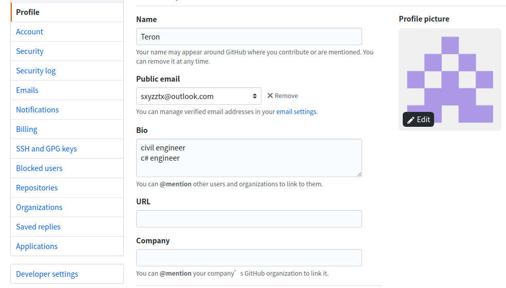
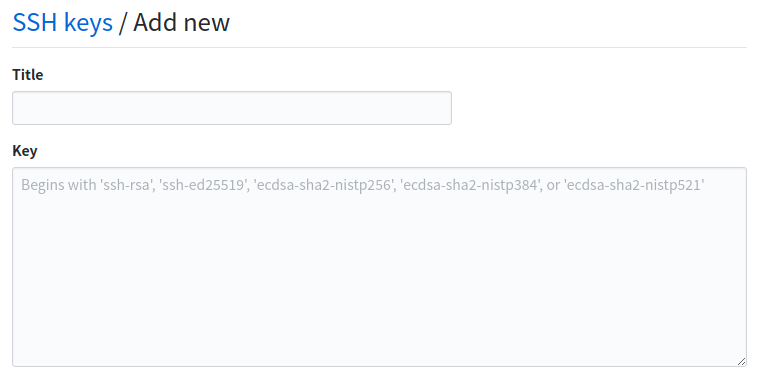

### 【Git使用笔记一】初次使用git配置, 同步远程代码

#### 1.  安传git

一般ubuntu在安装的时候默认会安装git，如果没有请安装git

```xml
$ sudo apt-get install git
```

#### 2.配置全局邮箱和用户名

```git
查看git配置列表： $git config --list
配置全局username： $git config --global user.name=xxx
配置全局email： $git config --global user.email = xxx
```

#### 4. 在github上添加ssh密钥

1. 输入$cd ~/.ssh，查看已有的ssh文件
2. 生成ssh $ssh-keygen -t rsa -b 4096 -C "sxyzztx@outlook.com"
3. 一路回车下去
4. 打开~/.ssh/id_rsa.pub
5. 打开github，在setting中点开ssh



6. 复制id_rsa.pub中的内容复制到下面的文本框中



#### 5.将本地代码上传到github上

1. link远程分支


