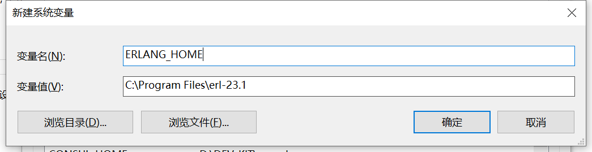
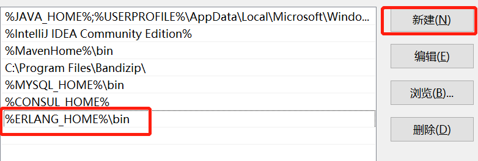
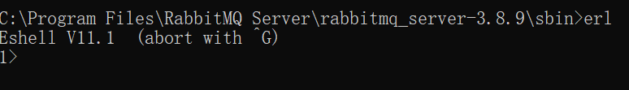
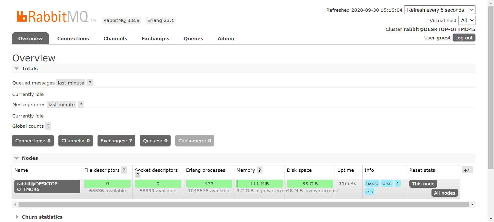

# RabbitMQ

## 安装

1. 安装erlang

   1. 下载otp

      地址： http://www.erlang.org/downloads

   2. 安装otp

   3. 设置环境变量

      1. 设置系统变量ERLANG_HOME

         

      2. 修改Path变量

         

   4. 验证安装结果

      

2. RabbitMQ

   1. 下载RabbitMQ

      地址：https://www.rabbitmq.com/download.html

   2. 点击安装

   3. 进入sbin文件夹

      C:\Program Files\RabbitMQ Server\rabbitmq_server-3.8.9\sbin

   4. 打开cmd，输入rabbitmq-plugins enable rabbitmq_management

   5. 进入http://localhost:15672/

      

   6. 账号名和密码都是guest，进入管理页

