# RabbitMQ

## MQ

消息队列，在消息传输过程中保存消息的容器，多用于分布式系统通信

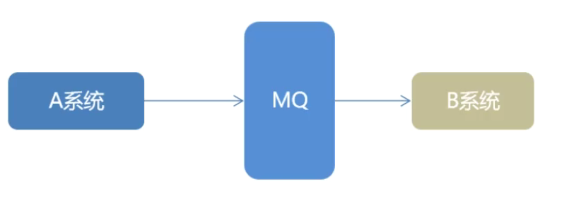 

### MQ的优劣

**优势**

1. 应用解耦

   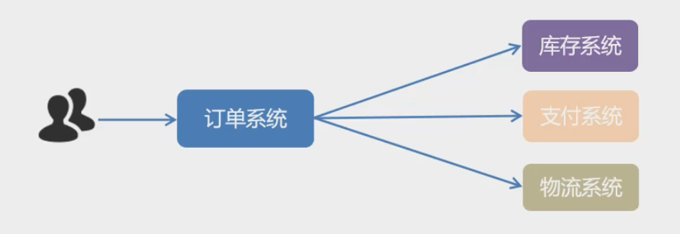

   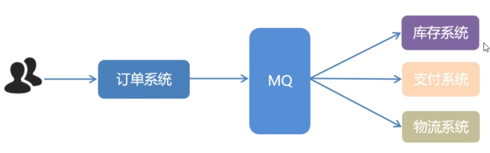

2. 异步提速

   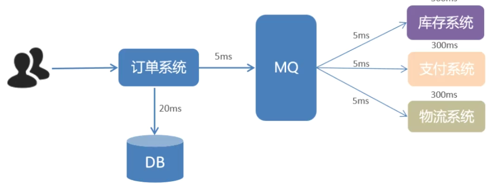

3. 削峰填谷

   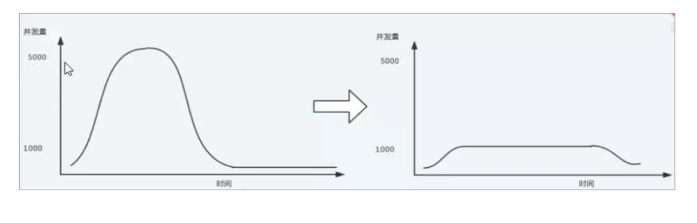

**劣势**

1. 系统可用性降低

2. 系统复杂度上升

3. 数据一致性问题

   mq给多个系统同时发送数据，如何保证消息值消费一次

### 使用MQ的前提

1. 生产者不需要消费者的反馈，异步成了可能
2. 允许暂时的不一致性
3. 用了确实有效果，使用mq的效益大于加入mq增加的管理成本

### 常见的MQ产品

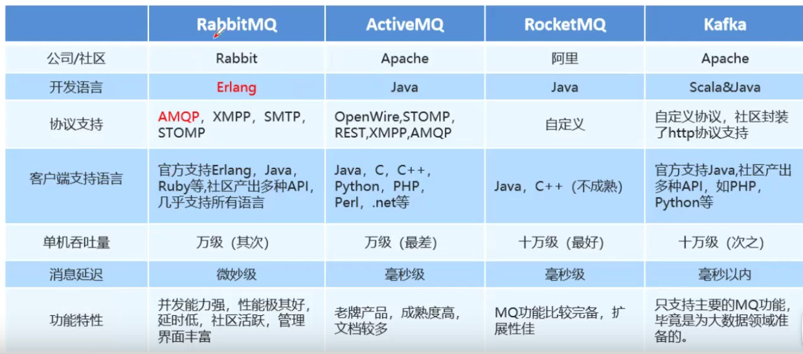

## RabbitMQ

### AMQP

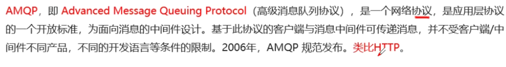

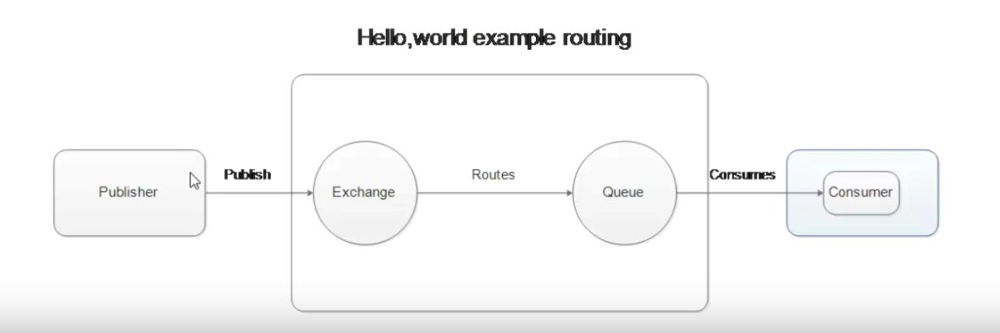

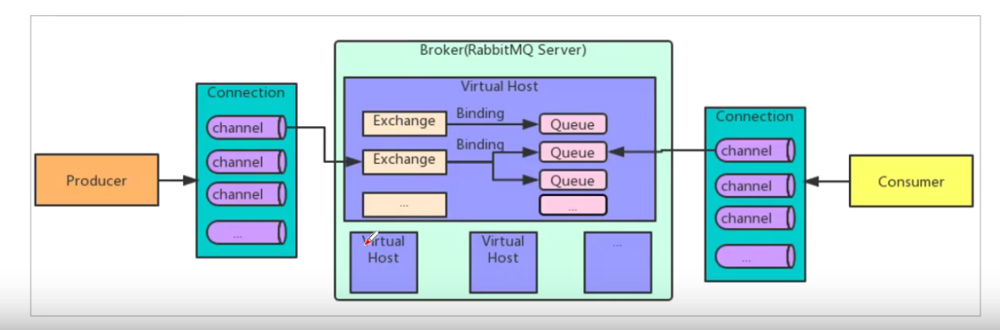

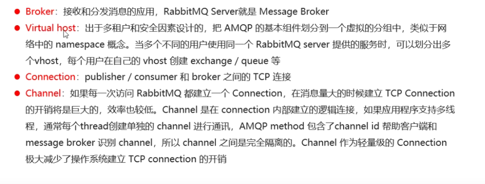

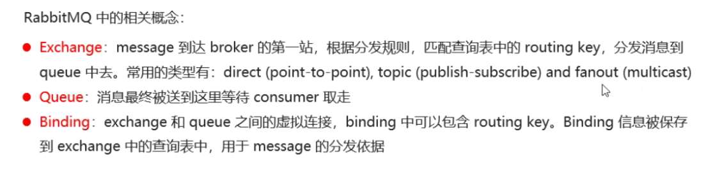

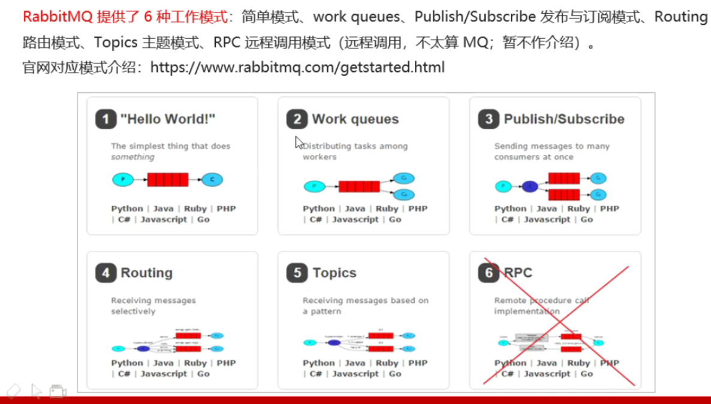

## 安装

