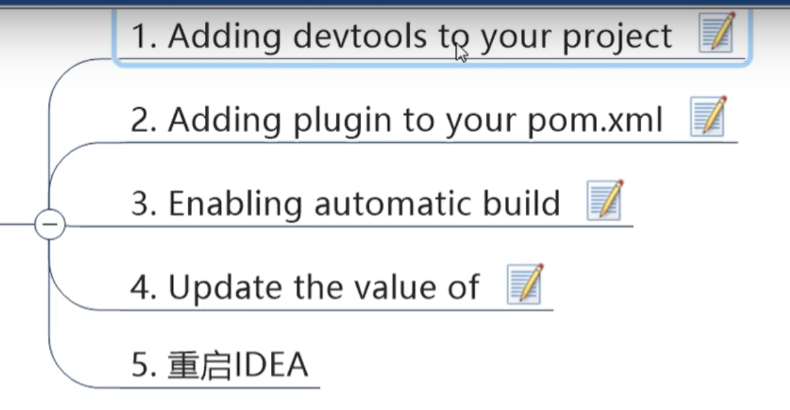
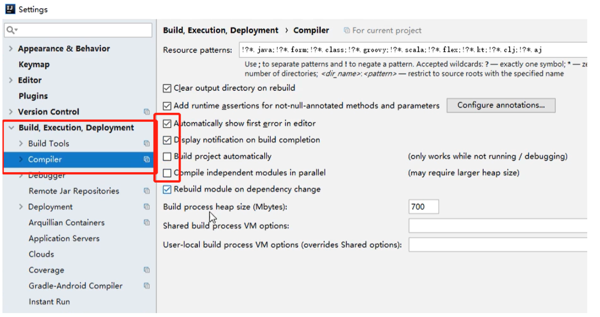
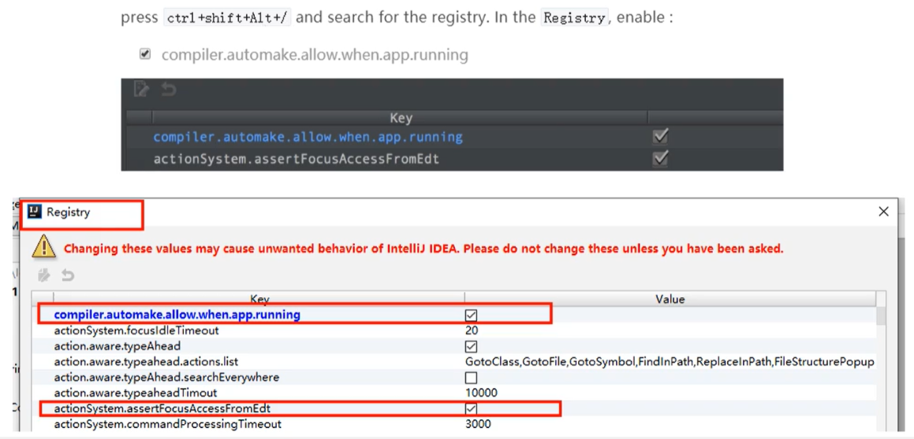

## Spring Cloud 微服务架构

## 1. 什么是微服务架构

略

### 2. Spring Boot/Cloud版本

​	springcloud H.SR1

​	SpringBoot 2.2.2Release

查询使用版本的方法，先确定springcloud的版本，然后去springcloud的官方文档中查看springboot的最佳版本

## 3. SpringCloud 组件升级


## 4. 微服务代码构建

#### 4.1 约定->配置->编码

#### 4.2 总父工程工作空间搭建


#### 4.3 dependencyManagement 和 dependencies的区别

dependecyManagement用来管理/定义依赖版本不实际引入依赖

dependencies 是实际引入依赖

建议在父总工程中使用dependencyManagement来管理版本，具体微服务使用dependencies来引入依赖，在dependcyManagement中已经指定版本的依赖，在引入的时候可以不写版本

#### 4.4 Maven跳过单元测试

idea maven选择小闪电跳过test单元测试

### 5. 搭建支付小模块

#### 5.1 微服务搭建流程


#### 5.2注意事项

1. pom中最常用的几个依赖

   ```xml
   <!-- mybatis starter-->
   <dependency>
       <groupId>org.mybatis.spring.boot</groupId>
       <artifactId>mybatis-spring-boot-starter</artifactId>
   </dependency>
   <!--druid连接池-->
   <dependency>
       <groupId>com.alibaba</groupId>
       <artifactId>druid-spring-boot-starter</artifactId>
       <version>1.1.10</version>
   </dependency>
   <!--mysql-connector-java-->
   <dependency>
       <groupId>mysql</groupId>
       <artifactId>mysql-connector-java</artifactId>
   </dependency>
   <!--jdbc-->
   <dependency>
       <groupId>org.springframework.boot</groupId>
       <artifactId>spring-boot-starter-jdbc</artifactId>
   </dependency>
   <!-- web actuator -->
   <dependency>
       <groupId>org.springframework.boot</groupId>
       <artifactId>spring-boot-starter-web</artifactId>
   </dependency>
   <dependency>
       <groupId>org.springframework.boot</groupId>
       <artifactId>spring-boot-starter-actuator</artifactId>
   </dependency>
   <!-- 通用配置 -->
   <!-- 热部署 -->
   <dependency>
       <groupId>org.springframework.boot</groupId>
       <artifactId>spring-boot-devtools</artifactId>
       <scope>runtime</scope>
       <optional>true</optional>
   </dependency>
   <dependency>
       <groupId>org.projectlombok</groupId>
       <artifactId>lombok</artifactId>
       <optional>true</optional>
   </dependency>
   <dependency>
       <groupId>org.springframework.boot</groupId>
       <artifactId>spring-boot-starter-test</artifactId>
       <scope>test</scope>
   </dependency>
   ```

2. yml基本版，基本上都得用上

   ```yml
   # application.yml 复制完了记得检查缩进
   # 服务器端口
server:
     port: 8001
spring:
     application:
       name: cloud-payment-service
     datasource:
       type: com.alibaba.druid.pool.DruidDataSource
       driver-class-name: com.mysql.jdbc.Driver
       url: jdbc:mysql://localhost:3306/cloudlearning?useUnicode=true&characterEncoding=utf-8&useSSL=false
       username: root
       password: root
   
   mybatis:
     # mapper所在位置
     mapperLocations: classpath:mapper/*.xml
     # mybatis别名
     type-aliases-package: com.atguigu.springcloud.entities, com.atguigu.cloud.commons.entities
   ```
   
3. 主启动类

   1. @SpringBootApplication
   2. SpringApplication.run(.class)

### 6. 热部署



#### 6.1 引入devTools依赖

```xml
<dependency>
    <groupId>org.springframework.boot</groupId>
    <artifactId>spring-boot-devtools</artifactId>
    <scope>runtime</scope>
    <optional>true</optional>
</dependency>
```

#### 6.2 增加maven编译插件

```xml
  <!-- 建议放在父总工程中-->
  <build>
    <plugins>
      <plugin>
        <groupId>org.springframework.boot</groupId>
        <artifactId>spring-boot-maven-plugin</artifactId>
        <configuration>
          <fork>true</fork>
          <addResources>true</addResources>
        </configuration>
      </plugin>
    </plugins>
  </build>
```

#### 6.3设置编译选项



#### 6.4 update values



#### 6.5 重启IDEA

### 7.消费者模块

​	同5，构建消费者模块，使用restTemplate来调用生产者订单接口

### 8.重构工程

将重复的内容：返回前台的通用dto以及多个模块通用的pojo实体放到一个commont包中去


# 9. 附录

## 父总工程的pom

```xml
<!-- 统一管理jar包版本 -->
<properties>
    <project.build.sourceEncoding>UTF-8</project.build.sourceEncoding>
    <maven.compiler.source>1.8</maven.compiler.source>
    <maven.compiler.target>1.8</maven.compiler.target>
    <junit.version>4.12</junit.version>
    <log4j.version>1.2.17</log4j.version>
    <lombok.version>1.16.18</lombok.version>
    <mysql.version>5.1.45</mysql.version>
    <druid.version>1.1.16</druid.version>
    <druid.spring.boot.starter.version>1.1.10</druid.spring.boot.starter.version>
    <spring.boot.version>2.2.2.RELEASE</spring.boot.version>
    <spring.cloud.version>Hoxton.SR1</spring.cloud.version>
    <spring.cloud.alibaba.version>2.1.0.RELEASE</spring.cloud.alibaba.version>
    <mybatis.spring.boot.version>1.3.0</mybatis.spring.boot.version>
    <mybatis-spring-boot-starter.version>2.1.1</mybatis-spring-boot-starter.version>
    <hutool-all.version>5.1.0</hutool-all.version>
</properties>

<!-- 子模块继承之后，提供作用：锁定版本 + 子module不用谢groupId和version -->
<dependencyManagement>
    <dependencies>
        <dependency>
            <groupId>org.springframework.boot</groupId>
            <artifactId>spring-boot-dependencies</artifactId>
            <version>${spring.boot.version}</version>
            <type>pom</type>
            <scope>import</scope>
        </dependency>
        <!--Spring cloud Hoxton.SR1-->
        <dependency>
            <groupId>org.springframework.cloud</groupId>
            <artifactId>spring-cloud-dependencies</artifactId>
            <version>${spring.cloud.version}</version>
            <type>pom</type>
            <scope>import</scope>
        </dependency>
        <!--Spring cloud alibaba 2.1.0.RELEASE-->
        <dependency>
            <groupId>com.alibaba.cloud</groupId>
            <artifactId>spring-cloud-alibaba-dependencies</artifactId>
            <version>${spring.cloud.alibaba.version}</version>
            <type>pom</type>
            <scope>import</scope>
        </dependency>
        <dependency>
            <groupId>mysql</groupId>
            <artifactId>mysql-connector-java</artifactId>
            <version>${mysql.version}</version>
        </dependency>
        <dependency>
            <groupId>com.alibaba</groupId>
            <artifactId>druid</artifactId>
            <version>${druid.version}</version>
        </dependency>
        <dependency>
            <groupId>com.alibaba</groupId>
            <artifactId>druid-spring-boot-starter</artifactId>
            <version>${druid.spring.boot.starter.version}</version>
        </dependency>
        <dependency>
            <groupId>org.mybatis.spring.boot</groupId>
            <artifactId>mybatis-spring-boot-starter</artifactId>
            <version>${mybatis-spring-boot-starter.version}</version>
        </dependency>
        <dependency>
            <groupId>org.projectlombok</groupId>
            <artifactId>lombok</artifactId>
            <version>${lombok.version}</version>
        </dependency>
    </dependencies>
</dependencyManagement>

<!-- 插件 -->
<build>
    <plugins>
        <plugin>
            <groupId>org.springframework.boot</groupId>
            <artifactId>spring-boot-maven-plugin</artifactId>
            <configuration>
                <fork>true</fork>
                <addResources>true</addResources>
            </configuration>
        </plugin>
    </plugins>
</build>

<!--第三方maven私服-->
<repositories>
    <repository>
        <id>nexus-aliyun</id>
        <name>Nexus aliyun</name>
        <url>http://maven.aliyun.com/nexus/content/groups/public</url>
        <releases>
            <enabled>true</enabled>
        </releases>
        <snapshots>
            <enabled>false</enabled>
        </snapshots>
    </repository>
</repositories>
```

