# Spring

## 概述

1. 轻量级JavaEE框架
2. Spring可以解决企业开发的复杂性
3. Spring核心
   1. IOC：spring创建管理bean对象
   2. AOP：面向切面编程
4. 特点
   1. 方便解耦
   2. AOP编程支持
   3. 方便程序测试
   4. 方便整合其他的框架
   5. 方便事务操作
   6. 降低API开发难度

## 入门案列

### 下载jar包

地址：https://repo.spring.io/release/org/springframework/spring/5.2.6.RELEASE/

收集5个核心jar包（spring的基础）

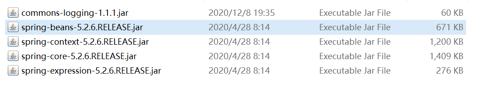

### 创建工程

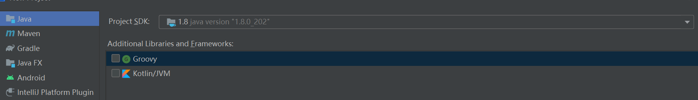

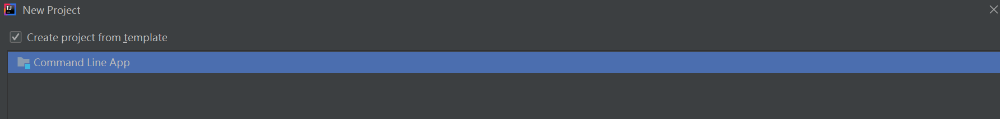

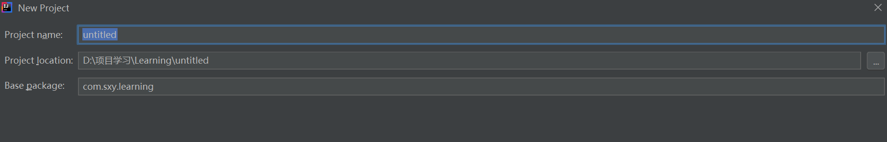

### 导包

1. 创建lib文件夹，将jar包复制进文件夹

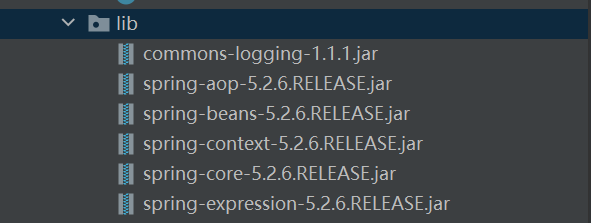

2. 导入jar包

   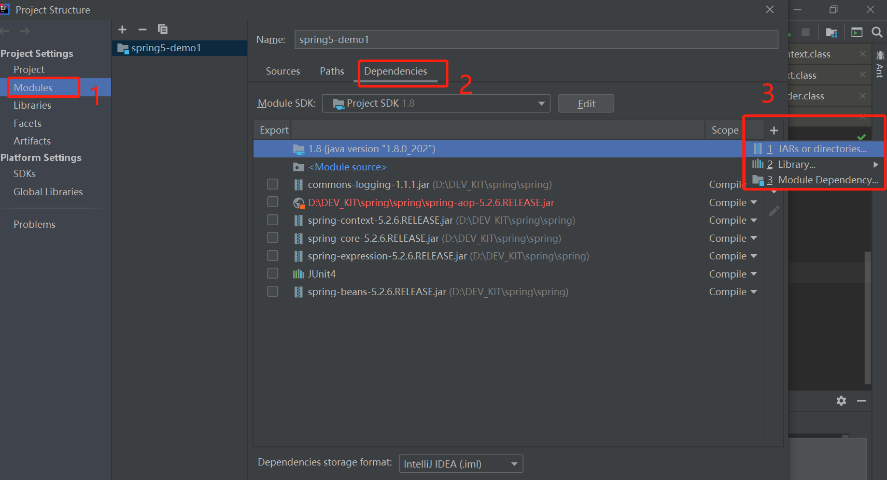

   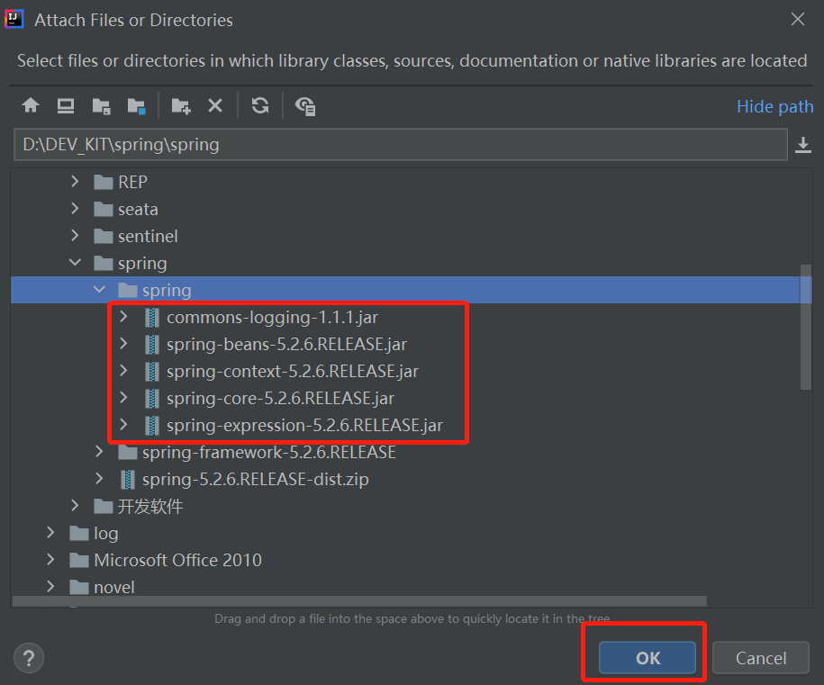


### 创建Bean组件类

```java
package com.sxy.learning;

public class User {
    public void add() {
        System.out.println("------>add<-------");
    }
}
```

### 创建bean.xml配置文件

```xml
<?xml version="1.0" encoding="UTF-8"?>
<beans xmlns="http://www.springframework.org/schema/beans"
       xmlns:xsi="http://www.w3.org/2001/XMLSchema-instance"
       xsi:schemaLocation="http://www.springframework.org/schema/beans
        https://www.springframework.org/schema/beans/spring-beans.xsd">

    <bean id="user" class="com.sxy.learning.User"></bean>

</beans>
```

### 创建测试类

```java
package com.sxy.learning.test;

import com.sxy.learning.User;
import org.junit.Test;
import org.springframework.context.ApplicationContext;
import org.springframework.context.support.ClassPathXmlApplicationContext;

public class TestSpring {
    @Test
    public void testUser() {
		// 加载上下文环境
        ApplicationContext context = new ClassPathXmlApplicationContext("beans.xml");
        // 获取Bean
        User user = context.getBean("user", User.class);
        // 测试bean的方法
        user.add();
    }
}
```

## IOC

1. 控制翻转，把对象创建和对象之间的调用过程，交给Spring进行管理
2. 使用IOC目的：为了降低耦合度

耦合度问题，两种方式实现对象调用，IOC实现耦合度降低到最低限度

正常情况下对象调用

### IOC底层原理

#### 使用的三种技术

1. XML解析
2. 工厂模式
3. 反射

#### 对象调用详解

1.  最原始，高耦合度的调用方式（new)

   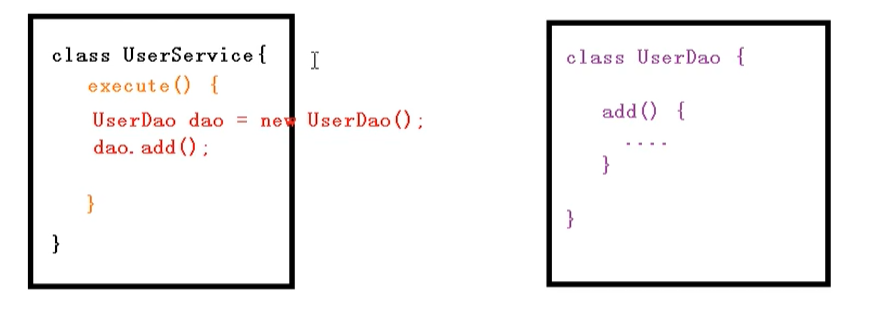

2. 使用工厂模式优化后的调用方式

   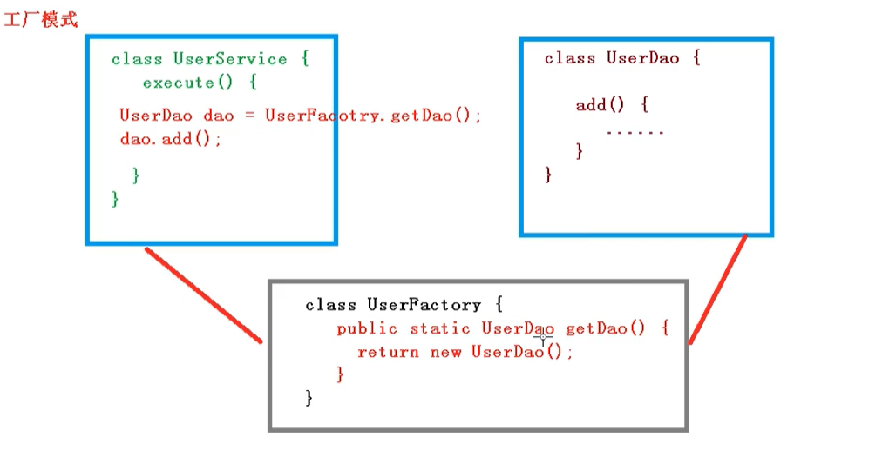

3. 使用IOC创建

   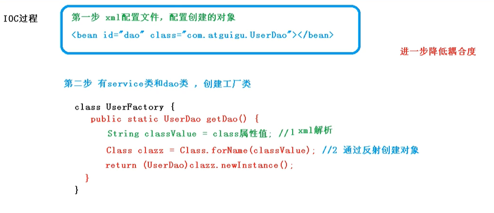

### IOC接口（两个接口)

1. BeanFactory

   Spring内部使用，外部开发人员不用

   只是加载配置文件，不会去主动创建bean对象

   在拿bean的时候，回去map拿，发现没有，会创建bean对象

2. ApplicationContext

   正常开发使用这个接口

   内部会调用beanfactory去加载配置文件，然后会初始化创建bean对象，在获取bean的时候是直接去从map中取得

从xml文件中获取配置的context接口有如下两个

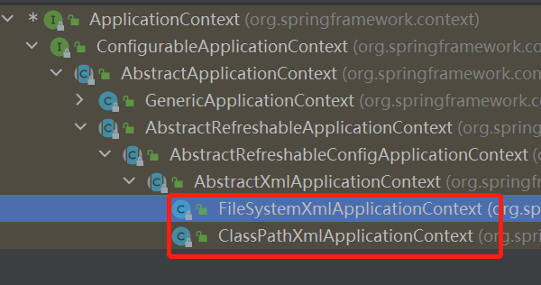


### IOC操作Bean管理(XML)

​	bean管理：ioc容器创建对象并且注入属性

​	DI：依赖注入，bean创建完了之后注入属性（对象的引用）

```xml
<?xml version="1.0" encoding="UTF-8"?>
<beans xmlns="http://www.springframework.org/schema/beans"
       xmlns:xsi="http://www.w3.org/2001/XMLSchema-instance"
       xsi:schemaLocation="http://www.springframework.org/schema/beans
        https://www.springframework.org/schema/beans/spring-beans.xsd">

    <bean id="user" class="com.sxy.learning.User"></bean>
</beans>
```

#### DI（依赖注入）

##### property方式注入属性

此方法前提是bean类中有set方法

```java
public class Book {
    private String name;
    // 仅为了测试Integer注入，实际价格应该用BigDecimal
    private Integer price;

    private Boolean enable;

    public void setName(String name) {
        this.name = name;
    }

    public void setPrice(Integer price) {
        this.price = price;
    }

    public void setEnable(Boolean enable) {
        this.enable = enable;
    }

    @Override
    public String toString() {
        return "Book{" + "name='" + name + '\'' + ", price=" + price +
                ", enable=" + enable + '}';
    }
}
```

```xml
<bean id="The Winner" class="com.sxy.learning.Book">
    <!--注入String-->
    <property name="name" value="The Winner"/>
    <!--注入Integer-->
    <property name="price" value="12"/>
    <!--注入Boolean-->
    <property name="enable" value="true"/>
</bean>
```

##### constructor注入属性

此方式使用的前提bean类要有对应的有参构造器

```java
package com.sxy.learning;
public class Order {
    private String name;
    private Integer amount;
    private Boolean useAble;

    public Order(String name, Integer amount) {
        this.name = name;
        this.amount = amount;
    }

    public void setUseAble(Boolean useAble) {
        this.useAble = useAble;
    }

    @Override
    public String toString() {
        return "Order{" + "name='" + name + '\'' + ", amount=" + amount +
                ", useAble=" + useAble + '}';
    }
}
```

```xml
<bean id="order" class="com.sxy.learning.Order">
    <constructor-arg name="name" value="Order89457"/>
    <constructor-arg name="amount" value="1111"/>
    <!-- 测试构造器注入和属性注入混用的情况 -->
    <property name="useAble" value="true"/>
</bean>
```

##### p空间注入

使用该方法注入的前提和属性注入相同

```xml
<!-- bean类同Book -->
<bean id="The Winner" class="com.sxy.learning.Book"
      p:name="The Winner" p:price="12" p:enable="true">
</bean>
```

使用方式：

​	p + ":" + 类属性名=“属性值”

##### c空间注入

使用该方法注入的前提和构造器注入相同

```xml
<!--bean同Order-->

<!-- c空间注入参数一：使用属性名称 -->
<!--    <bean id="order" class="com.sxy.learning.Order" c:name="Order89457" c:amount="1111" p:useAble="true">-->
<!--    </bean>-->

<!-- c空间注入参数二：使用位置参数 -->
<bean id="order" class="com.sxy.learning.Order" c:_0="Order89457" c:_1="1111" p:useAble="true">
</bean>
```

##### 字面量注入

1. null值

   1. 不注入值，就能让属性为空了
   2. 使用<null>标签

2. 属性值包含特殊符号

   属性内容包含<>这样的符号

   1. 使用\&lt;\&gt;来代替<>
   2. 使用CDATA标签

   ```xml
   <bean id="The Winner" class="com.sxy.learning.Book">
       <property name="name" value="The Winner"/>
       <property name="price" value="12"/>
       <property name="enable" value="true"/>
       <!-- 空标签 -->
       <property name="author">
           <null/>
       </property>
       <!--        <property name="author" value="&lt;&gt;nanjing"/>-->
       <property name="author">
           <value><![CDATA[<<南京>>]]></value>
       </property>
   </bean>
   ```

##### 对象注入

bean定义

```java
package com.sxy.learning;

public class Emp {
    private String name;
    private Integer age;
    private Dept dept;

    public String getName() {
        return name;
    }

    public void setName(String name) {
        this.name = name;
    }

    public Integer getAge() {
        return age;
    }

    public void setAge(Integer age) {
        this.age = age;
    }

    public Dept getDept() {
        return dept;
    }

    public void setDept(Dept dept) {
        this.dept = dept;
    }

    @Override
    public String toString() {
        return "Emp{" + "name='" + name + '\'' + ", age=" + age +
                ", dept=" + dept + '}';
    }
}
```

```java
package com.sxy.learning;

public class Dept {
    private String name;
    private String description;

    public void setName(String name) {
        this.name = name;
    }

    public void setDescription(String description) {
        this.description = description;
    }

    public String getName() {
        return name;
    }

    public String getDescription() {
        return description;
    }

    @Override
    public String toString() {
        return "Dept{" + "name='" + name + '\'' + ", description='"
                + description + '\'' + '}';
    }
}

```

1. 外部bean注入

   ```xml
   <!-- 外部bean -->
   <bean id="emp" class="com.sxy.learning.Emp" p:name="张三" p:age="22" p:dept-ref="dept">
   
   </bean>
   <bean id="dept" class="com.sxy.learning.Dept">
       <property name="name" value="安保"/>
       <property name="description" value="Security Guard"/>
   </bean>
   ```

2. 内部bean注入

   ```xml
   <bean id="emp" class="com.sxy.learning.Emp" p:name="张三" p:age="22">
       <property name="dept">
           <bean id="dept" class="com.sxy.learning.Dept">
               <property name="name" value="安保"/>
               <property name="description" value="Security Guard"/>
           </bean>
       </property>
   </bean>
   ```

3. 级联赋值

   ```xml
   <!-- 级联赋值 -->
   <bean id="emp" class="com.sxy.learning.Emp" p:name="张三" p:age="22">
       <property name="dept" ref="dept"/>
       <property name="dept.description" value="new Department"/>
   </bean>
   <bean id="dept" class="com.sxy.learning.Dept">
       <property name="name" value="安保"/>
       <property name="description" value="Security Guard"/>
   </bean>
   ```


##### 集合属性注入

1. list列表：<list/> <value>

2. set集合：<set/> <value>
3. map：<map>、<entry>
4. 数组：<array> <value>
5. 对象数组：把之前用value的地方用ref替换

```java
public class Student {
    private String name;
    private Boolean graduated;
    private Integer age;
    private List<Course> courses;
    private List<String> books;
    private Map<String, String> teacherClass;
    private Set<String> subjects;
    private String[] friends;
	// 省略set方法
}
```

```java
public class Course {
    private String name;
	// 省略必要方法
}
```

```xml
<bean id="student" class="com.sxy.learning.Student" p:name="xiaoming" p:age="22">
    <property name="graduated" value="false"/>
    <!-- list属性注入配置 -->
    <property name="books">
        <list>
            <value>三体</value>
            <value>国富论</value>
        </list>
    </property>
    <!-- map属性注入配置 -->
    <property name="teacherClass">
        <map>
            <entry key="zhangsan" value="biology"/>
            <entry key="lisi" value="math"/>
        </map>
    </property>
    <!-- set属性注入配置 -->
    <property name="subjects">
        <set>
            <value>civil engineering</value>
            <value>computer science</value>
        </set>
    </property>
    <!-- 数组属性注入配置 -->
    <property name="friends">
        <array>
            <value>lihong</value>
            <value>hanmeimei</value>
        </array>
    </property>
    <!-- 对象list属性注入配置 -->
    <property name="courses">
        <list>
            <ref bean="course1"/>
            <ref bean="course2"/>
        </list>
    </property>
</bean>
<bean id="course1" class="com.sxy.learning.Course" p:name="course1"/>
<bean id="course2" class="com.sxy.learning.Course" p:name="course2"/>
```

6. 集合属性提取后注入

   增加util命名空间

   ```xml
   <beans xmlns="http://www.springframework.org/schema/beans"
          xmlns:xsi="http://www.w3.org/2001/XMLSchema-instance"
          xmlns:util="http://www.springframework.org/schema/util"
          xsi:schemaLocation="http://www.springframework.org/schema/beans
           https://www.springframework.org/schema/beans/spring-beans.xsd
           http://www.springframework.org/schema/util
           https://www.springframework.org/schema/util/spring-util.xsd">
   </beans>
   ```

   util简单说，就是把原来集合标签里的元素移到util下面

   bean定义和1-5相同，下面展示配置文件写法

   ```xml
   <util:list id="util_books">
       <value>三体</value>
       <value>国富论</value>
   </util:list>
   <util:map id="util_teacher_class">
       <entry key="zhangsan" value="biology"/>
       <entry key="lisi" value="math"/>
   </util:map>
   <util:set id="util_subjects">
       <value>civil engineering</value>
       <value>computer science</value>
   </util:set>
   <util:list id="util_courses">
       <ref bean="course1"/>
       <ref bean="course2"/>
   </util:list>
   <bean id="student" class="com.sxy.learning.Student" p:name="xiaoming" p:age="22">
       <property name="graduated" value="false"/>
       <property name="books" ref="util_books"/>
       <property name="teacherClass" ref="util_teacher_class"/>
       <property name="subjects" ref="util_subjects"/>
       <property name="friends">
           <array>
               <value>lihong</value>
               <value>hanmeimei</value>
           </array>
       </property>
       <property name="courses" ref="util_courses"/>
   </bean>
   <bean id="course1" class="com.sxy.learning.Course" p:name="course1"/>
   <bean id="course2" class="com.sxy.learning.Course" p:name="course2"/>
   ```

#### 两种Bean类型

1. 普通bean

   上面讲的都是普通bean，普通bean的特征是，配置文件中class是什么类型getBean拿到的就是什么类型

2. 工厂bean

   与普通bean不同的是，getBean方法拿到的bean类型取决于实现的getObject方法

   工厂bean需要实现FactoryBean<T>接口

   例如：

   ```java
   package com.sxy.learning;
   
   import org.springframework.beans.factory.FactoryBean;
   
   public class MyBean implements FactoryBean<Course> {
       @Override
       public Course getObject() throws Exception {
           return new Course("123131");
       }
   
       @Override
       public Class<?> getObjectType() {
           return Course.class;
       }
   
       @Override
       public boolean isSingleton() {
           return true;
       }
   }
   ```

   ```xml
   <bean id="myBean" class="com.sxy.learning.MyBean"/>
   ```

   1. 在调用getBean()方法拿myBean的时候，返回的是getObject中创建的bean
   2. isSingleton()决定getObject中创建的bean是否是单例
   3. 如果想要拿到工厂bean，需要在名字前加上&符号例如：context.getBean("&myBean", MyBean.class);

   单元测试举例：

   ```java
       @Test
       public void testBeanFactory() {
           ApplicationContext context =
                   new ClassPathXmlApplicationContext("beansFactory.xml");
           Course course1 = context.getBean("myBean", Course.class);
           Course course2 = context.getBean("myBean", Course.class);
           System.out.println(course1);
           System.out.println(course2);
           // 同isSingleton()方法返回的值
           System.out.println(course1 == course2);
           // 工厂bean的获取方式
           MyBean myBean = context.getBean("&myBean", MyBean.class);
           System.out.println(myBean);
       }
   ```

#### bean的范围

​	<bean>标签的scope属性，决定了bean的创建是否是单例

1. singleton: 创建的bean是单列，并且在context初始化的时候就完成了创建
2. prototype：创建的bean不是单例，在context初始化的时候仅完成类信息注册，创建是在调用getBean方法的时候随用随创建的

#### bean的生命周期

1. 生命周期：从创建到被销毁过程

2. bean生命周期：

   1. 通过构造器创建bean（无参构造器）
   2. 为bean设置属性或其他bean的引用
   3. 调用指定的init方法（需要配置）
   4. bean创建完成，使用
   5. 关闭IOC容器，调用指定的destroy方法（需要配置）

   ```java
   package com.sxy.learning;
   
   public class Course {
       private String name;
   
       public Course() {
           System.out.println("第一步，构造器创建bean对象");
       }
   
       public Course(String name) {
           this.name = name;
       }
   
       public void setName(String name) {
           this.name = name;
           System.out.println("第二步，设置bean对象的属性");
       }
   
       @Override
       public String toString() {
           return "Course{" +
                   "name='" + name + '\'' +
                   '}';
       }
   
       /*init方法，在bean配置时指定可以在创建bean之前调用*/
       public void init() {
           System.out.println("Step 3, init");
       }
       
       /*destroy方法，在bean配置时指定可以在关闭context销毁bean之前调用*/
       public void destroy() {
           System.out.println("Step5, destroy");
       }
   }
   ```

   ```xml
   <bean id="course" class="com.sxy.learning.Course" p:name="course1" init-method="init" destroy-method="destroy"/>
   ```

3. bean的后置处理器

   Step3前后可以有后置处理器的处理方法

   实现`BeanPostProcessor`接口，然后配置该bean，在创建bean的时候回自动调用

   ```java
   package com.sxy.learning;
   
   import org.springframework.beans.BeansException;
   import org.springframework.beans.factory.config.BeanPostProcessor;
   
   public class MyBeanPost implements BeanPostProcessor {
       @Override
       public Object postProcessBeforeInitialization(Object bean, String beanName) throws BeansException {
           System.out.println("init之前处理");
           return bean;
       }
   
       @Override
       public Object postProcessAfterInitialization(Object bean, String beanName) throws BeansException {
           System.out.println("init之后处理");
           return bean;
       }
   }
   ```

   ```xml
   <bean id="course" class="com.sxy.learning.Course" p:name="course1" init-method="init" destroy-method="destroy"/>
   <bean id="courseCopy" class="com.sxy.learning.Course" p:name="Math" init-method="init" destroy-method="destroy"/>
   <bean id="myBeanPost" class="com.sxy.learning.MyBeanPost"/>
   ```

#### 自动装配

1. 自动装配

   装配（Assemble）：就是把各个独立的bean组件拼接在一起的过程（其实就是DI完成的）

   自动装配：装配这个过程是有spring来自动完成

2. autowire

   <bean>标签有个autowire属性，其代表的是自动装配的规则。可选值有byName、byType、constructor、no、default

   常见的两个值：

   1. byName：通过名称来自动装配

   2. byType：通过类型来自动装配 

       ps：如果有相同类型的多个bean对象，会导致冲突

   ```java
   public class Emp {
       private String name;
       private Dept dept;
   	// ...省略setter和toString代码
   }
   ```

   ```java
   public class Dept {
       private String name;
       // ...省略setter和toString代码
   }
   ```

   ```xml
   <bean id="emp" class="com.sxy.learning.Emp" p:name="zhangsan" autowire="byName"/>
   <bean id="dept" class="com.sxy.learning.Dept" p:name="Civil"/>
   ```

#### 获取属性文件的值

1. 引入context命名空间

   ```xml
   <beans xmlns="http://www.springframework.org/schema/beans"
          xmlns:xsi="http://www.w3.org/2001/XMLSchema-instance"
          xmlns:context="http://www.springframework.org/schema/context"
          xsi:schemaLocation="http://www.springframework.org/schema/beans
           https://www.springframework.org/schema/beans/spring-beans.xsd
           http://www.springframework.org/schema/context
           https://www.springframework.org/schema/context/spring-context.xsd">
   </beans>
   ```

2. 引入properties文件

   ```xml
   <context:property-placeholder location="classpath:1.properties"/>
   ```

3. 获取properties的值

   ```xml
   <bean id="test" class="com.sxy.learning.Dept" p:name="${word}"/>
   ```

### IOC操作Bean管理(注解)

#### Spring提供注解

1. Component
2. Service
3. Controller
4. Respository

四个注解功能是一致的，都能用于创建bean，具体的名称可读性更好，可以告诉开发人员bean组件的角色

#### 具体操作

1. 引入AOP依赖（具体方法见入门案列）

   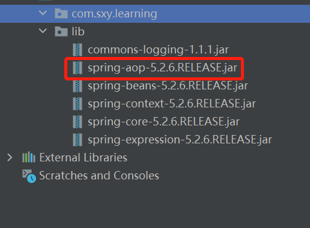

2. 开启组件扫描

   ```xml
   <context:component-scan base-package="com.sxy.learning"/>
   ```

3. 创建Bean类

   ```java
   @Service
   public class TestService {
       public void doSomething() {
           System.out.println("handle some issue");
       }
   }
   ```

4. 验证即可

#### 组件自动扫描过滤配置

1. 只创建指定的注解修饰的类

```xml
<context:component-scan base-package="com.sxy.learning" use-default-filters="false">
    <context:include-filter type="annotation" expression="org.springframework.stereotype.Service"/>
</context:component-scan>
```

2. 不创建指定注解修饰的类

```xml
<context:component-scan base-package="com.sxy.learning" use-default-filters="true">
    <context:exclude-filter type="annotation" expression="org.springframework.stereotype.Service"/>
</context:component-scan>
```

#### 自动装配注入属性

1. Autowired 根据类型注入
2. Qualifier 根据名称注入    **ps：需要和Autowired同时使用**
3. Resources 可以根据名称也可以根据类型 **ps: 该注解是javax中的**

4. Value 字符串注入

```java
@Controller
public class TestController {

    @Autowired
    @Qualifier("specialService") // 加了就是根据名称来注入，不加就是类型注入
    private TestService testService;

    // 省略构造器和setter/getter
}
```

验证建议TestService不使用自动扫描来创建bean，因为自动扫描出来的只有一个单例，你没有办法去判断到底是类型注入还是名称注入。所以，TestService Bean的创建我使用手动创建，可以使用bean也可以使用下文的java Config的方式

```java
@Configuration
@ComponentScan(basePackages = {"com.sxy.learning.service"})
public class Config {

    @Bean()
    public TestService specialService() {
        return new TestService("special");
    }

    @Bean()
    public TestService normalService() {
        return new TestService("normal");
    }
}
```

   ```java
@Controller
public class TestController {
    
    /**
     * 不加name属性，那么就是类型注入，如果加了name属性，那么就是名称注入
     */
    @Resource(name = "normalService")
    private TestService testService;
    
    // 省略构造器和setter/getter
}
   ```


#### 纯净不写任何xml文件版本

1. 导包和上面是一样的

2. 创建bean类和xml是一样的

3. 创建config类

   ```java
   @Configuration
   @ComponentScan(basePackages = {"com.sxy.learning.service"}) // 自动扫描组件
   public class Config {
   
       /**
        * 创建bean
        * 几乎和xml一致，xml中有的autowire属性在@Bean注解中也能指定
        * 注入属性和依赖比xml配置要简单，直接用java语法就能完成
        */
       @Bean()
       public TestService testName() {
           TestService service = new TestService();
           service.setName("kaha");
           return service;
       }
       
   
       /**
        * 注入依赖的场景
        * 1. 如果参数名称和创建的某个bean的名称一致，那么会注入这个bean
        * 2. 如果参数名称与所有相同类型的bean都不同，那么会按类型去注入，此时如果有多个相同类型的bean则会报错
        */
       @Bean()
       public TestController testController(TestService name) {
           return new TestController(name);
       }
   }
   ```

4. 在获取context的时候与xml有所不同

   ```java
   @Test
   public void testConfigInject() {
       // 获取context
       ApplicationContext context = new AnnotationConfigApplicationContext(Config.class);
       TestService testName = context.getBean("testName", TestService.class);
       TestService testName2 = context.getBean("testName2", TestService.class);
       System.out.println(testName);
       System.out.println(testName2);
       TestController testController = context.getBean("testController", TestController.class);
       testController.test();
       System.out.println(testController.getTestService());
   }
   ```

   

## AOP

面向切面编程：**这种在运行时，动态地将代码切入到类的指定方法、指定位置上的编程思想就是面向切面的编程**

**对原有代码毫无入侵性****把和主业务无关的事情，放到代码外面去做。****AOP像OOP一样，只是一种编程范式，AOP并没有规定说，实现AOP协议的代码，要用什么方式去实现。**


### 底层原理（待完善）

动态代理：

[	浅谈JDK动态代理（上）](https://zhuanlan.zhihu.com/p/62534874)

​	[浅谈JDK动态代理（中）](https://zhuanlan.zhihu.com/p/62660956)

​	[浅谈JDK动态代理（下）](https://zhuanlan.zhihu.com/p/63126398)

1. 如果有接口，使用JDK动态代理

2. 如果没有接口使用cglib动态代理

动态代理代码举例


### AOP术语

1. 连接点

   可以增强的方法

2. 切入点

   已经增强的方法

3. 通知（增强）

   1. 环绕型 Around
   2. 前置型 Before
   3. 后置型 After
   4. 异常性 AfterThrowing
   5. 最终型 AfterReturning

4. 切面

   将通知应于与连接点，增强方法的过程


### 操作

#### 导包

手动导包太麻烦了，包还要自己去下，现在换maven

pom.xml:

```xml
<?xml version="1.0" encoding="UTF-8"?>
<project xmlns="http://maven.apache.org/POM/4.0.0"
         xmlns:xsi="http://www.w3.org/2001/XMLSchema-instance"
         xsi:schemaLocation="http://maven.apache.org/POM/4.0.0 http://maven.apache.org/xsd/maven-4.0.0.xsd">
    <modelVersion>4.0.0</modelVersion>

    <groupId>org.sxy.learning</groupId>
    <artifactId>spring5-demo5</artifactId>
    <version>1.0-SNAPSHOT</version>

    <dependencies>
        <dependency>
            <groupId>org.springframework</groupId>
            <artifactId>spring-aop</artifactId>
            <version>5.2.7.RELEASE</version>
        </dependency>
        <dependency>
            <groupId>org.springframework</groupId>
            <artifactId>spring-beans</artifactId>
            <version>5.2.7.RELEASE</version>
        </dependency>
        <dependency>
            <groupId>org.springframework</groupId>
            <artifactId>spring-context</artifactId>
            <version>5.2.7.RELEASE</version>
        </dependency>
        <dependency>
            <groupId>org.springframework</groupId>
            <artifactId>spring-core</artifactId>
            <version>5.2.7.RELEASE</version>
        </dependency>
        <dependency>
            <groupId>org.springframework</groupId>
            <artifactId>spring-expression</artifactId>
            <version>5.2.7.RELEASE</version>
        </dependency>
        <dependency>
            <groupId>commons-logging</groupId>
            <artifactId>commons-logging</artifactId>
            <version>1.2</version>
        </dependency>
        <dependency>
            <groupId>org.springframework</groupId>
            <artifactId>spring-aspects</artifactId>
            <version>5.2.7.RELEASE</version>
        </dependency>
        <!-- https://mvnrepository.com/artifact/net.sourceforge.cglib/com.springsource.net.sf.cglib -->
        <dependency>
            <groupId>net.sourceforge.cglib</groupId>
            <artifactId>com.springsource.net.sf.cglib</artifactId>
            <version>2.2.0</version>
        </dependency>
        <!-- https://mvnrepository.com/artifact/org.aspectj/com.springsource.org.aspectj.weaver -->
        <dependency>
            <groupId>org.aspectj</groupId>
            <artifactId>com.springsource.org.aspectj.weaver</artifactId>
            <version>1.6.4.RELEASE</version>
        </dependency>
        <!-- https://mvnrepository.com/artifact/org.aopalliance/com.springsource.org.aopalliance -->
        <dependency>
            <groupId>org.aopalliance</groupId>
            <artifactId>com.springsource.org.aopalliance</artifactId>
            <version>1.0.0</version>
        </dependency>
        <dependency>
            <groupId>org.projectlombok</groupId>
            <artifactId>lombok</artifactId>
            <version>1.16.18</version>
        </dependency>
        <dependency>
            <groupId>junit</groupId>
            <artifactId>junit</artifactId>
            <version>4.12</version>
            <scope>test</scope>
        </dependency>
    </dependencies>

</project>
```

#### 切入点表达式

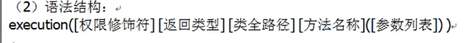

​	切入点表达式：描述增强的方法

切入表达式举例：

1. 具体包具体类具体方法

   execution(* com.sxy.learning.TestClass.test(..))

2. 具体包具体类所有方法

   execution(* com.sxy.learning.TestClass.**(..))

3. 具体包所有类所有方法

   

#### 注解方式操作aop

#### xml方式操作aop

#### 各个通知的顺序

#### 提取相同切入点

#### 不同增强类，对同一个切入点的增强方法调用顺序

ASPECTJ语法：https://www.cnblogs.com/bjlhx/p/12081493.html

## Spring-JdbcTemplate

导包

新增依赖：

```xml

```

## 事务

1. 事务注解加在service层

编程式事务管理和声明式事务管理

底层使用的是AOP

API

DataSourceTransactionManager

Transactional

1. propagation: 事务传播行为

   事务方法互相调用

   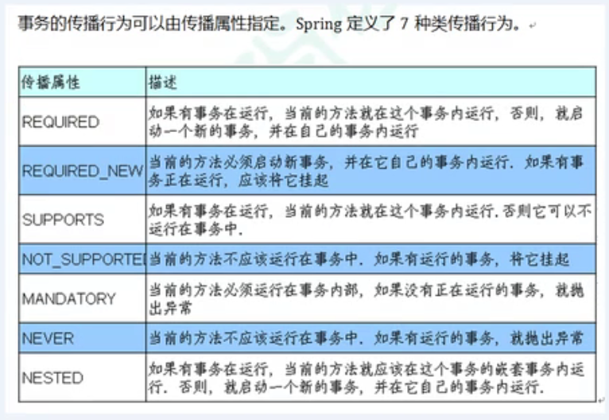

   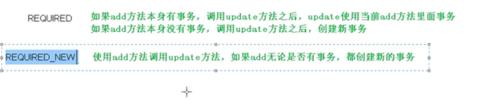

   默认？

   2. 隔离性
   3. timeout：超时时间
   4. readOnly：只读
   5. rollbackFor: 设置出现哪些异常回滚
   6. noRollbackFor: 设置哪些异常出现不回滚

# Spring5 框架新功能

1. 框架代码基于jdk8，运行时兼容JDK9，许多不建议使用的方法和类在代码中删除
2. Spring5框架自带了通用的日志框架
   1. Spring5移除了Log4JConfigListener，官方建议使用Log4J2

### Spring5整合日志框架

```xml
<dependency>
    <groupId>org.apache.logging.log4j</groupId>
    <artifactId>log4j-api</artifactId>
    <version>2.11.2</version>
</dependency>
<dependency>
    <groupId>org.apache.logging.log4j</groupId>
    <artifactId>log4j-core</artifactId>
    <version>2.11.2</version>
</dependency>
<dependency>
    <groupId>org.slf4j</groupId>
    <artifactId>slf4j-api</artifactId>
    <version>1.7.30</version>
</dependency>
<dependency>
    <groupId>org.apache.logging.log4j</groupId>
    <artifactId>log4j-slf4j-impl</artifactId>
    <version>2.11.2</version>
</dependency>
```

log4j2.xml

```xml
<?xml version="1.0" encoding="UTF-8"?>
<!--日志级别以及优先级排序: OFF > FATAL > ERROR > WARN > INFO > DEBUG > TRACE > ALL -->
<!--Configuration后面的status用于设置log4j2自身内部的信息输出，可以不设置，当设置成trace时，可以看到log4j2内部各种详细输出-->
<?import org.apache.logging.log4j.core.layout.PatternLayout?>
<configuration status="INFO">
    <!--先定义所有的appender-->
    <appenders>
        <!--输出日志信息到控制台-->
        <console name="Console" target="SYSTEM_OUT">
            <!--控制日志输出的格式-->
            <PatternLayout pattern="%d{yyyy-MM-dd HH:mm:ss.SSS} [%t] %-5level %logger{36} - %msg%n"/>
        </console>
    </appenders>
    <!--然后定义logger，只有定义了logger并引入的appender，appender才会生效-->
    <!--root：用于指定项目的根日志，如果没有单独指定Logger，则会使用root作为默认的日志输出-->
    <loggers>
        <root level="info">
            <appender-ref ref="Console"/>
        </root>
    </loggers>
</configuration>
```

添加日志

```java
@Controller
@Slf4j
public class AccountController {

    @Autowired
    private AccountService accountService;

    public void transfer(String transferName, String beTransferredName, BigDecimal money) {
        log.info("begin to transfer");
        accountService.transfer(transferName, beTransferredName, money);
        log.info("end to transfer");
    }
}
```

PS: 遇到一个错误：Log4j2 could not find a logging implementation

傻逼IDEA缓存的问题，清理缓存重启就行了

## @Nullable

可以使用在方法上，属性上，参数上

1. 用在方法上：方法的返回值可以为空
2. 用在方法的参数上：方法的参数可以为空
3. 用在属性上：属性可以为空

好像我不用，他不能为空似的

编译器和IDE警告

## 函数式注册bean

GenericContext

## SpringWebFlux

占坑，netty看完再看

