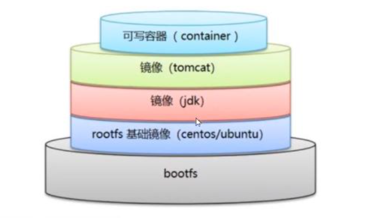

# Docker

## 简介

容器虚拟化技术

为了解决开发运维之间环境不一致导致的运维部署问题。

开发人员将开发好的程序带上环境组成镜像，打包给运维人员，运维人员可以直接使用

文档： https://docs.docker.com/

作用： 应用的更快速的交付和部署

## 基本概念


1. 镜像 模板，容器根据这个模板创建
2. 容器 构建一个沙箱，开发人员提供的服务在沙箱内运行，该沙箱根据容器运行
3. 仓库 放镜像的地方

## 安装

```shell
# 卸载旧版本
yum remove docker \
                  docker-client \
                  docker-client-latest \
                  docker-common \
                  docker-latest \
                  docker-latest-logrotate \
                  docker-logrotate \
                  docker-engine
                  
# 安装yum-util工具（为了使用yum-config)
yum install -y yum-utils

# 配置yum源国内镜像
yum-config-manager \
    --add-repo \
    https://download.docker.com/linux/centos/docker-ce.repo

yum-config-manager \
    --add-repo \
    https://mirrors.aliyun.com/docker-ce/linux/centos/docker-ce.repo
    
# 安装docker
yum install docker-ce docker-ce-cli containerd.io

# 查看docker版本
docker version

```


```shell
# 启动docker
systemctl start docker

# hello-world 验证启动成功否
docker run hello-world
```


### 配置镜像加速器


```shell
sudo mkdir -p /etc/docker
sudo tee /etc/docker/daemon.json <<-'EOF'
{
  "registry-mirrors": ["https://dfk1ed0b.mirror.aliyuncs.com"]
}
EOF
sudo systemctl daemon-reload
sudo systemctl restart docker
```

### docker run 流程


## 底层原理


## 常用命令

### 镜像命令

```shell
#显示docker版本信息
docker version
#
docker info
docker --help

```


```shell
docker images


-a
-q
```


docker search

```shell
--filter

```


docker pull mysql

```shell
docker pull mysql
docker pull mysql:5.7
# 联合文件系统，分层下载
```


docker rmi

```shell
docker rmi -f [container id...] #删除
docker rmi -f $(docker images -aq) # 删除所有镜像

```

### 容器命令

ps：有镜像才可以创建容器

docker run

```shell
docker run [可选参数] image

-name='name' 区分容器
-d # 后台方式运行jar
-i -t # 使用交互方式运行
-p # 制定容器端口 -p 8080:9090
	-p 主机端口: 容器端口
	-p 容器端口
	-p 
-P # 随机制定容器端口
```

 docker ps

查看正在运行容器

```shell
docker ps
-a # 查看所有容器，包括历史运行过的容器
-n=? # 查看最近的容器
-q # 只显示容器id

```

退出容器

```shell
exit # 停止容器并退出
control + P + Q # 不终止容器退出
```

删除容器

```shell
docker rm -f [container id...]    #删除制定容器
docker rm -f $(docker images -aq) # 删除所有容器
docker ps -a -q| xargs docker rm  # 删除所有容器
```

启动停止

```shell
docker start   [容器id]  # 启动容器
docker restart [容器id]  # 重启容器
docker stop [容器id]     # 停止容器
docker kill [容器id]     # 强制停止容器
```

### 常用的其他命令

后台启动容器

```shell
docker run -d centos # 后台启动centos

# 问题docker ps，发现 centos 停止

# 常见的坑： docker后台启动， 就必须要有一个前台应用， docker发现没有前台应用就会自动停止
# 

```

日志

```shell
docker logs [OPTIONS] CONTAINER

Options:
        --details        显示更多的信息
    -f, --follow         跟踪实时日志
        --since string   显示自某个timestamp之后的日志，或相对时间，如42m（即42分钟）
        --tail string    从日志末尾显示多少行日志， 默认是all
    -t, --timestamps     显示时间戳
        --until string   显示自某个timestamp之前的日志，或相对时间，如42m（即42分钟）
```


查看容器的元数据

```shell
docker inspect [容器id]

[root@Tang-6 ~]# docker container inspect -f {{.NetworkSettings.Networks.bridge.IPAddress}} mybox1
172.17.0.2
[root@Tang-6 ~]# docker container inspect -f {{.NetworkSettings.Networks.bridge.Gateway}} mybox1

```


进入容器

```shell
# 在容器中执行一个命令，相当于重新用run命令如果带it参数执行，则会打开一个交互环境
docker exec -it [容器id] 命令

# 会进入容器当前正在运行的命令，如果之前run的时候带了-ti那么会打开一个交互环境
docker attach [容器]

```


不小心让死循环打印让docker没空间了

报错：

Error response from daemon: mkdir /var/lib/docker/overlay2/d55336f2eb3d878af2bedacad64f63631278cdf2961efe68f4e53c1e0b1a3b31-init: no space left on device.

解决

```shell
docker system prune -a
```


从容器拷贝文件到本地文件系统

```shell
docker cp 83282d781f12:/home/test.java /home/

docker cp [容器id]:[文件地址] [本地文件地址]
```


## 练习

### nginx

```shell
docker search nginx
docker pull nginx
docker run -d --name nginx01 -p 3344:80 nginx
```

端口暴露的概念


配置文件在容器内修改很麻烦，怎么才能做个映射，外部配置文件修改能用于容器内 -v数据卷技术

### tomcat

```shell
docker run -ti --rm tomcat:9.0
# -rm用完即删， 一般用于测试
docker run -it -p 3345:8080 tomcat:9.0 /bin/bash
```

部署项目每次都要进入容器，能不能在容器外部放一个webApps，在外部放项目，就自动同步到内部


### ES+kibana

问题

```shell
# es 暴露的端口十分多
# 

docker run -d --name elastic -p 9200:9300 -p 9300:9300 -e "discovery.type=single-node" elasticsearch:7.6.2


# 直接启动内存不够直接报错
[root@iZuf6dmodzug16xc7usoe8Z ~]# docker run -d --name elastic -p 9200:9300 -p 9300:9300 -e "discovery.type=single-node" elasticsearch:7.6.2
99f0a4c7f52ce7cc93e38642418823b1df0f5ffe6e763e1d575e8e2874d9721d
[root@iZuf6dmodzug16xc7usoe8Z ~]# docker ps
CONTAINER ID   IMAGE     COMMAND   CREATED   STATUS    PORTS     NAMES
[root@iZuf6dmodzug16xc7usoe8Z ~]# docker logs 99f0a4c7f52ce7cc93e38642418823b1df0f5ffe6e763e1d575e8e2874d9721d
OpenJDK 64-Bit Server VM warning: Option UseConcMarkSweepGC was deprecated in version 9.0 and will likely be removed in a future release.
OpenJDK 64-Bit Server VM warning: INFO: os::commit_memory(0x00000000c5330000, 986513408, 0) failed; error='Not enough space' (errno=12)
#
# There is insufficient memory for the Java Runtime Environment to continue.
# Native memory allocation (mmap) failed to map 986513408 bytes for committing reserved memory.
# An error report file with more information is saved as:
# logs/hs_err_pid1.log


# 限制内存
docker run -d --name elastic -p 9200:9200 -p 9300:9300 -e "discovery.type=single-node" -e ES_JAVA_OPTS="-Xms64m -Xmx512m" elasticsearch:7.6.2

# 查询容器状态
docker stats [容器id]

```


## 可视化

* portainer

  ```shell
  # 安装
  docker run -d -p 8088:9000 --restart=always -v /var/run/docker.sock:/var/run/docker.sock --privileged=true portainer/portainer
  ```

  

* 


## 联合文件系统


## 镜像分层下载


## commit镜像


## 容器数据卷

### 什么是数据卷

容器中的数据都是保存在容器中的，如果将容器删除，容器中的数据变不复存在了。在实际生产中这种情况是不被允许的，因此需要引入数据持久化技术

容器数据卷技术就是为了解决这个问题出现的

容器数据卷解决了两个问题

1. 容器数据持久化问题
2. 容器之间数据共享问题

### 使用

```shell
docker run -v [容器内部路径] centos # 匿名挂载
docker run -v [juming]:[容器内部路径] centos #具名挂载
docker run -v [外部路径]:[容器内部路径] centos #指定路径挂载

docker volume ls # 查看所有的容器卷
docker volume inspect [volume-id] # 查看容器数据卷的详细内容

docker run -v [容器内部路径]:ro # 限定容器对文件只有读取权限 readOnly
docker run -v [容器内部路径]:rw # 限定容器对文件有读写权限 readWrite
```


### 初始DockerFile

```shell
FROM centos

VOLUME ["volume1", "volume2"]

CMD "/bin/bash"
```

```shell
# 构建
docker build -f dockerfile -t sxy001/centos .
```

### 容器间数据共享

```shell
#  构建一个容器，然后使用--volumes-from参数来共享容器间数据
docker run -it --name mycent01 sxy001/mycentos:0.1
docker run -it --name mycent02 --volumes-from mycent01 sxy001/mycentos:0.1
docker run -it --name mycent03 --volumes-from mycent01 sxy001/mycentos:0.1
```

构建的三个容器之间的关系为，2和3的数据卷和1同步，三个数据卷在本地有唯一数据卷地址对应，三个对应相同的地址

## Docker File

### dockerfile构建过程

1. 每个保留关键字，命令必须大写
2. 执行从上到下顺序执行
3. #表示注释
4. 每个命令都会创建一个镜像层



dockerfile是面向开发的

### 指令

```shell
FROM
MAINTAINER
RUN
ADD
WORKDIR
VOLUME
EXPOSE
CMD
ENTRYPOINT
ENV
ONBUILD
COPY
```


### 构建一个属于自己的centos镜像

```shell
# 我自己的centos支持vim和ifconfig命令
FROM centos
MAINTAINER sunxuyang<sxyzztx@outlook.com>

ENV MY_PATH "/usr/local"
WORKDIR $MY_PATH

RUN yum -y install vim
RUN yum -y install net-tools

CMD "echo $MY_PATH"
CMD "/bin/bash"
EXPOSE 80
```


```shell
docker build -f mycentos -t sxy001/mycentos:0.2 .
```


## 网络原理

## IDEA 整合docker

## Docker Compose

## Docker Swarm

## CI/CD Jekins


