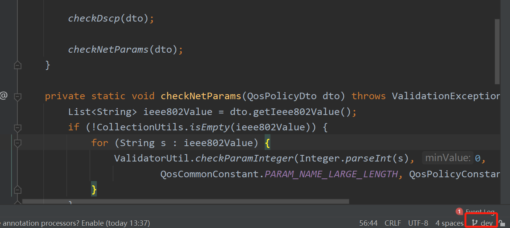
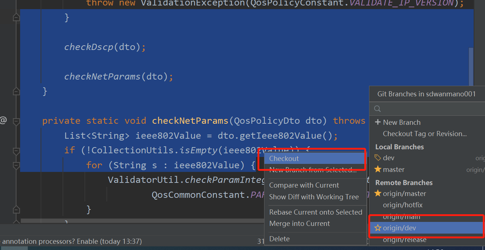

# Git

## 切换远程分支

1. 命令行

   ```shell
   git branch -a // 查看所有分支（包括远程，不加-a就只是显式本地分支）
   git checkout -b [本地分支名] [远程分支名]
   ```

2. 用idea

   用idea打开对应的项目

   打开后单击右下角

   

   然后选择你想要切换的分支，单击后选择checkout

   