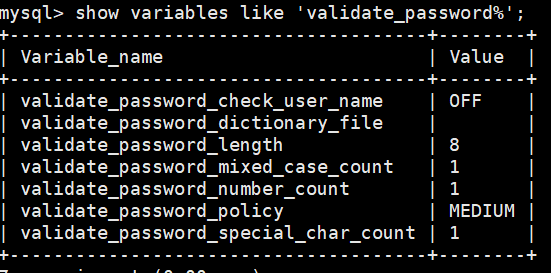

[toc]

# Mysql

## 安装

### windows下

1. 下载mysql

   下载地址： https://downloads.mysql.com/archives/installer/

   版本选择5系列，8系列也可以，就是java连接器不一样

2. 点击安装，配置服务即可

### Linux

愉快的踩了很多坑，必须吐槽网上很多博客都不是自己写的，抄特么都抄出问题，我按着博客步骤走，每一步都出问题，我也是醉了

1. 下载RPM配置文件

   ```shell
   wget -i -c http://dev.mysql.com/get/mysql57-community-release-el7-10.noarch.rpm
   ```

2. 安装仓库

   ```shell
   yum -y install mysql57-community-release-el7-10.noarch.rpm
   ```

3. 安装mysql-community-server

   ```shell
   yum -y install mysql-community-server
   ```

   坑：

   直接输入命令安装，报错：Unable to find a match: mysql-community-server

   解决：

   1. yum module disable mysql
   2. yum -y install mysql-community-server

4. 启动mysql

   ```shell
   systemctl start mysql.service
   ```

   坑：Unit mysqld.service could not be found.

   解决：

   1. find / -name mysql.server，发现没有这个文件

   2. find / -name mysqld，找到两个相匹配的内容，一个文件夹一个文件

      

   3. cp /usr/sbin/mysqld /etc/init.d/mysqld, 将文件复制到init.d下，就我的理解，如果找到mysql.service就复制mysql.service，不要有msyql.service复制成mysqld这种骚操作
   4. systemctl start mysqlld

5. 登录mysql

   ```shell
   mysql -u root -p
   ```

   密码怎么找：

   ```shell
   cat /var/log/mysqld.log
   ```

   找到类似这种：2021-02-08T01:41:26.338680Z 1 [Note] A temporary password is generated for root@localhost: jpu7-&riOiWo

   密码就是jpu7-&riOiWo

6. 初始化设置密码

   ```shell
   alter user user() identified by '密码规则一大写一小写一特殊字符长度搞个8位左右'
   ```

   密码不符合规则报错：ERROR 1819 (HY000): Your password does not satisfy the current policy requirements

   密码策略：

   

7. 参考资料

   1. 安装：https://www.cnblogs.com/calm84/p/12666882.html

   2. Unable to find a match: mysql-community-server：https://blog.csdn.net/qq_40251815/article/details/110119632

   3. 启动服务发现服务不存在：https://blog.csdn.net/oZuoShen123/article/details/105755964/

   4. mysql初始密码设置问题：https://blog.csdn.net/xy8310292/article/details/81087685

      

## Sql基础

### DDL

#### 创建数据库

```sql
/* 创建数据库*/
CREATE DATABASE dataBaseName;
```

## GUI程序连接云服务器上的mysql

