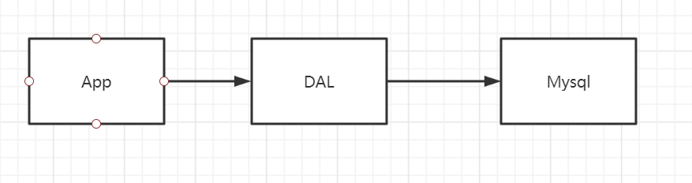
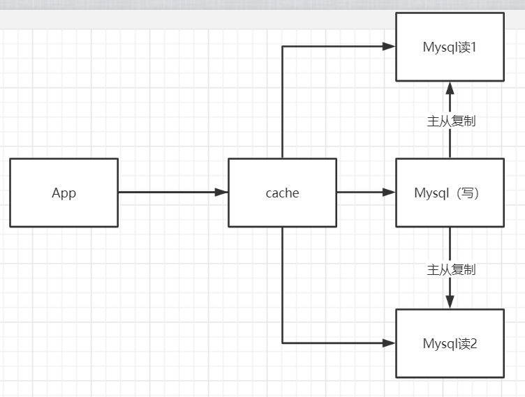
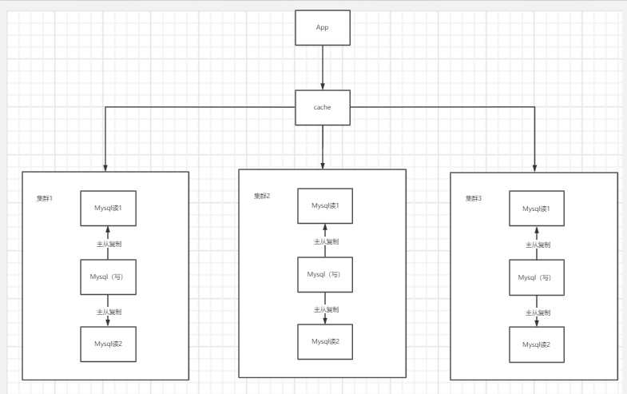
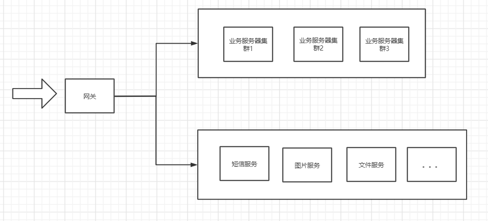

# Redis

## 快速使用

1. 解压下载好的redis.zip文件
2. 进入目录打开cmd
3. 输入命令： <code>./redis-server.exe redis.windows.conf</code>

## Nosql概述

### 为什么使用NOSQL

1. 传统的关系型数据库已经无法支撑起当前时代的数据量

2. 日益丰富的数据类型（如：图片，文档），关系型数据hold不住了

   

3. Mysql单机的局限性

   1. 数据量过大，机器放不下
   2. 单表索引，内存放不下
   3. 访问大导致，服务器受不了

#### 整体架构演进

##### Mysql单机架构

早期传统的网站架构，App调用数据访问层访问单机Mysql

**瓶颈**

1. 当数据量增大，单机容量不够
2. 随着数据量的增大，单表的缓存会导致单机的内存不够
3. 访问量增大，单机“扛”不住

##### Memcached + Mysql +垂直拆分

>  主从复制和读写分离 + 缓存

App通过缓存来查询数据库中的数据，App大多数时候是在读操作，缓存能够极大地提高性能。并且此时我们数据分了主从节点，能提高系统的可用性

**但是这种架构并没有解决数据量增大导致的一系列问题**。

##### 分库分表+水平拆分+缓存

分库分表，将原有数据库拆分成3份，每个集群各占一部分，这样就能解决单个数据库集群数据量过大的问题。并且由于减小了数据库单表，从而能够提升写的性能。

同时，每个单独的集群内部，使用的是主从复制读写分离那一套，提高数据库的可用性和性能。

##### 最新架构

> 数据类型的日渐丰富，关系型数据库越来越力不从心，非关系型数据库走上舞台

在分库分表+主从分离的基础上抽离出各个特色服务，例如短信服务，图片服务，文件服务等，这就是现代分布式服务架构

### Nosql特点

* 方便扩展（数据之间没有关系，便于扩展）
* 大数据高性能
* 数据类型多样（不需要设计数据库）

### NoSql四大分类

* **kv键值对**

  * **Redis**
  * Tair
  * Memcache

* **文档型**

  * **MongoDB**：介于关系型和非关系型之间，非关系型中功能最丰富的数据库
  * ConthDB

* **列存储数据库**

  * HBase
  * 分布式文件系统

* **图关系型**

  主要用于社交系统和推荐系统

  * **Neo4j**
  * InfoGrid

## Redis概述

> Redis（Remote Directory server)远程字典服务

一个开源的使用ANSI [C语言](https://baike.baidu.com/item/C语言)编写、支持网络、可基于内存亦可持久化的日志型、Key-Value[数据库](https://baike.baidu.com/item/数据库/103728)，并提供多种语言的API。

redis会周期性的把更新的数据写入磁盘或者把修改操作写入追加的记录文件，并且在此基础上实现了master-slave(主从)同步。

> 能干什么？

1. 内存存储、持久化（内存断点即失）
2. 效率高，可用于告诉缓存
3. 发布订阅系统
4. 地图信息分析
5. 计时器、计数器

> 特性

1. 多样的数据类型（String,List....)
2. 持久化
3. 事务
4. 集群
5. .....

## 安装

### Windows

1. 下载安装包
2. 解压
3. 运行

### Linux

