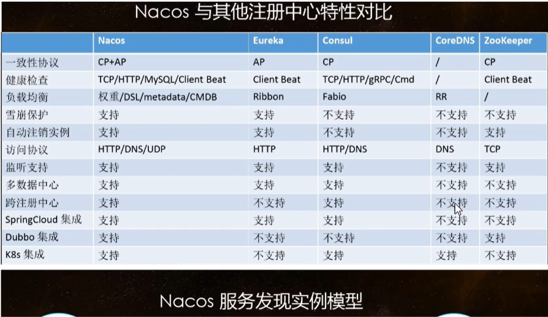

# Nacos之注册中心


## 使用

1. pom

   ```xml
   <!-- nacos client -->
   <dependency>
       <groupId>com.alibaba.cloud</groupId>
       <artifactId>spring-cloud-starter-alibaba-nacos-discovery</artifactId>
   </dependency>
   ```

2. yml

   ```yml
   server:
     port: 9002
   
   spring:
     application:
       name: cloud-provider-payment
   
     cloud:
       nacos:
         discovery:
           server-addr: localhost:8848
   
   management:
     endpoints:
       web:
         exposure:
           include: '*'
   ```

3. 主启动类增加@EnableDiscoveryClient


## 几种注册中心比较



### Nacos支持AP和CP模式的切换

