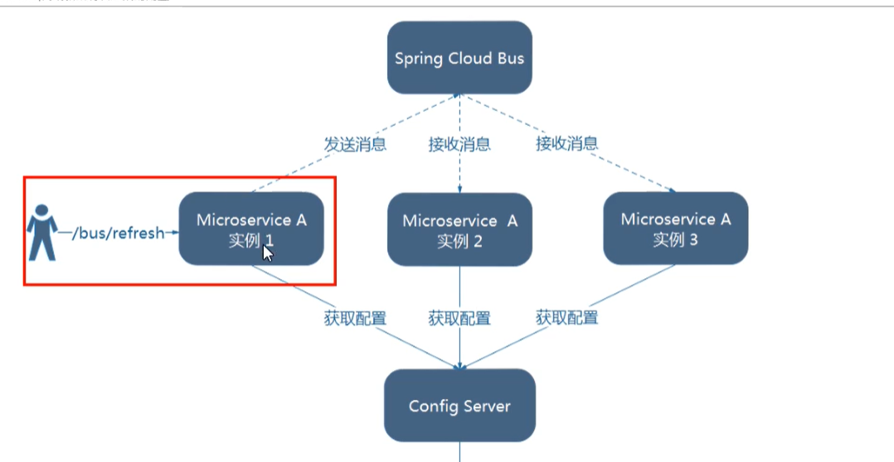
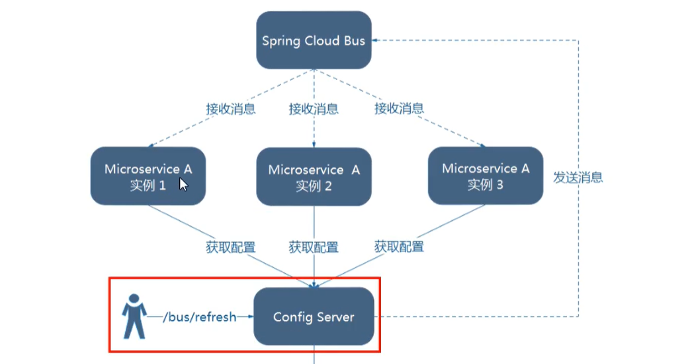

# Bus

配合spring-config，实现全局广播自动刷新配置


在使用springcloud bus 服务总线需要前提：消息中间件已经正确安装，目前支持RabbitMq以及Kafka





## 使用

1. pom依赖

   ```xml
   <dependency>
       <groupId>org.springframework.cloud</groupId>
       <artifactId>spring-cloud-starter-bus-amqp</artifactId>
   </dependency>
   ```

2. rabbit配置

   ```yml
   spring:
     rabbitmq:
       host: localhost
       port: 5672
       username: guest
       password: guest
   ```

   **注意：客户端服务发现注解一定要用EnableDiscoveryClient，用EnableEurekaClient无法实现自动刷新**

3. 在config-server中暴露bus-refresh接口

   ```yml
   management:
     endpoints:
       web:
         exposure:
           include: "bus-refresh"
   ```

4. 调用config-server的bus-refresh接口

   ```shell
   // 定点刷新微服务配置
   curl http://localhost:7003/actuator/bus-refresh/cloud-config-client:3366 -X POST
   // 自动刷新所有服务配置
   curl http://localhost:7003/actuator/bus-refresh/ -X POST
   ```

   