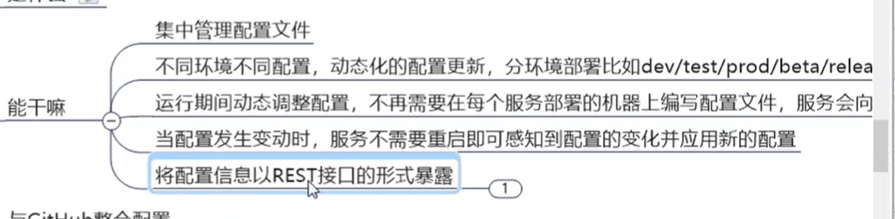
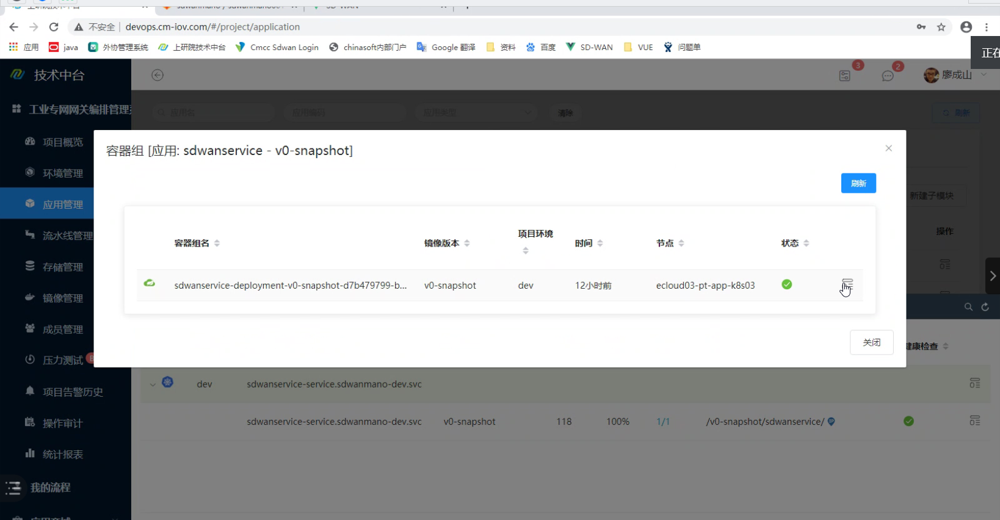

# Config配置中心

## 概述


 **为什么要配置中心**

大量相同服务的不同实例以及不同服务之间相同的配置需要一个第三方来集中管理，不然在修改配置的时候会变得异常麻烦

 **配置中心的作用**



## How To Use

### **搭建config服务端**

1. pom

```xml
<!-- 基本款config服务中心,用的是spring-cloud-config -->
<dependencies>
    <dependency>
        <groupId>org.springframework.cloud</groupId>
        <artifactId>spring-cloud-config-server</artifactId>
    </dependency>
    <!--SpringCloud consul-server-->
    <dependency>
        <groupId>org.springframework.cloud</groupId>
        <artifactId>spring-cloud-starter-consul-discovery</artifactId>
    </dependency>
    <!-- web actuator -->
    <dependency>
        <groupId>org.springframework.boot</groupId>
        <artifactId>spring-boot-starter-web</artifactId>
    </dependency>
    <dependency>
        <groupId>org.springframework.boot</groupId>
        <artifactId>spring-boot-starter-actuator</artifactId>
    </dependency>
    <!-- 通用配置 -->
    <!-- 热部署 -->
    <dependency>
        <groupId>org.springframework.boot</groupId>
        <artifactId>spring-boot-devtools</artifactId>
        <scope>runtime</scope>
        <optional>true</optional>
    </dependency>
    <dependency>
        <groupId>org.projectlombok</groupId>
        <artifactId>lombok</artifactId>
        <optional>true</optional>
    </dependency>
    <dependency>
        <groupId>org.springframework.boot</groupId>
        <artifactId>spring-boot-starter-test</artifactId>
        <scope>test</scope>
    </dependency>
</dependencies>
```

2. application.yml

   ```yml
   server:
     port: 3344
   
   spring:
     application:
       name: cloud-configuration-center
     cloud:
       config:
         server:
           git:
             uri: https://github.com/monstersun/springcloud-config.git
             search-paths:
               - springcloud-config
   
         label: master
   
       consul:
         host: localhost
         port: 8500
   ```

3. 主启动类

   ```java
   @SpringBootApplication
   @EnableDiscoveryClient
   @EnableConfigServer
   public class ConfigCenter3344 {
       public static void main(String[] args) {
           SpringApplication.run(ConfigCenter3344.class, args);
       }
   }
   ```

**修改hosts文件，模拟自己本身是其他机器**

路径：C:\Windows\System32\drivers\etc

```properties
############### springcloud #########################
127.0.0.1    eureka7001.com
127.0.0.1    eureka7002.com
127.0.0.1    eureka7003.com
127.0.0.1    config-center.com
############### springcloud #########################
```

### 配置读取规则

```
/{application}/{profile}[/{label}]
/{application}-{profile}.yml
/{label}/{application}-{profile}.yml
/{application}-{profile}.properties
/{label}/{application}-{profile}.properties
```

```properties
http://config-center.com:3344/config-dev.yml # 默认master，因为我们配的label：master
http://config-center.com:3344/config/dev/master
http://config-center.com:3344/master/config-dev.yml
```

### 搭建客户端

1. pom

   ```xml
   <dependencies>
       <!--config客户端-->
       <dependency>
           <groupId>org.springframework.cloud</groupId>
           <artifactId>spring-cloud-starter-config</artifactId>
       </dependency>
       <!--SpringCloud consul-server-->
       <dependency>
           <groupId>org.springframework.cloud</groupId>
           <artifactId>spring-cloud-starter-consul-discovery</artifactId>
       </dependency>
       <!-- web actuator -->
       <dependency>
           <groupId>org.springframework.boot</groupId>
           <artifactId>spring-boot-starter-web</artifactId>
       </dependency>
       <dependency>
           <groupId>org.springframework.boot</groupId>
           <artifactId>spring-boot-starter-actuator</artifactId>
       </dependency>
       <!-- 通用配置 -->
       <!-- 热部署 -->
       <dependency>
           <groupId>org.springframework.boot</groupId>
           <artifactId>spring-boot-devtools</artifactId>
           <scope>runtime</scope>
           <optional>true</optional>
       </dependency>
       <dependency>
           <groupId>org.projectlombok</groupId>
           <artifactId>lombok</artifactId>
           <optional>true</optional>
       </dependency>
       <dependency>
           <groupId>org.springframework.boot</groupId>
           <artifactId>spring-boot-starter-test</artifactId>
           <scope>test</scope>
       </dependency>
   </dependencies>
   ```

2. 创建bootstrap.yml

   ```yml
   # 为什么使用bootstrap而不是application
   # 因为bootstrap先application一步加载，加载完bootstrap再加载application，如果在application中写配置，那么在加载配置中心的配置的时候是来不及的
   server:
     port: 3355
   
   spring:
     cloud: 
       config:
         label: master #label
         name: config #application 可以写多个逗号隔开就好
         profile: dev # profile
         uri: http://localhost:3344
   ```

3. 写业务类或者配置类加载配置中心配置

   可以通过@Value直接获得配置中心的我们自己配置的属性内容

## 将数据内容放入配置中心，创建数据库

1. 把一下内容放到配置中心的配置文件中

   ```yml
   spring:
     datasource:
       type: com.alibaba.druid.pool.DruidDataSource
       driver-class-name: com.mysql.jdbc.Driver
       url: jdbc:mysql://localhost:3306/cloudlearning?useUnicode=true&characterEncoding=utf-8&useSSL=false
       username: root
       password: root
   
   mybatis:
     mapperLocations: classpath:mapper/*.xml
     type-aliases-package: com.atguigu.springcloud.entities, com.atguigu.cloud.commons.entities
   ```
   
2. 更新github，然后将mysql的依赖导入pom，重启微服务就行了

3. 原理：我们的应用在启动后，会先根据bootstrap.yml的内容初始化bootstrap上下文，然后先去配置中心获取配置文件，然后才会初始化springboot，启动

## 自动刷新(手动版)

1. client端yml修改

   ```yml
   # 暴露actuator 的refresh接口
   management:
     endpoints:
       web:
         exposure:
           include: "*"
   ```

2. 获取配置值的地方增加@RefreshScope

   ```java
   @RefreshScope
   public class ConfigController {
       @Value("${config.info}")
       private String configInfo;
   	// ....
   }
   ```

3. 手动刷新接口

   ```
   一定要用POST方法
   http://localhost:3355/actuator/refresh
   ```


