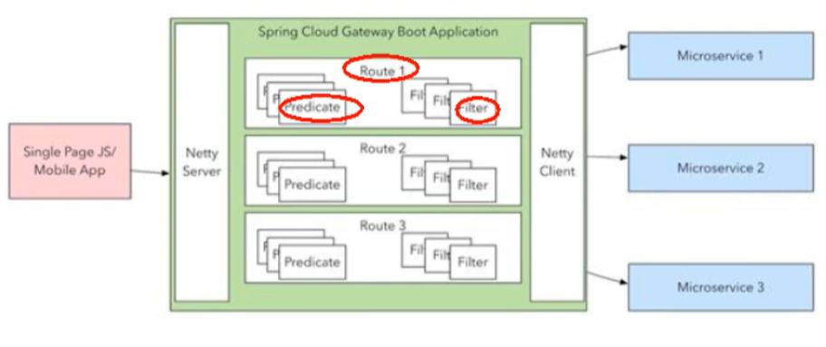

# 服务网关

为什么不用zull

1. zuul1技术不在更新，zuul2一直不出,zuul阻塞式IO，gatewayNIO非阻塞
2. SpringCloud Gateway是基于WebFlux框架实现的，而WebFlux框架底层则使用了高性能的Reactor模式通信框架Netty，Spring Cloud 2.0以上版本中，没有对新版本的Zuul 2.0以上最新高性能版本进行集成，仍然还是使用的Zuul 2.0之前的非Reactor模式的老版本

## 三个重要概念

1. 路由器

   网关主要组成部分，请求进入网关通过路由器转发给真实服务

2. 断言Predicate

   Pridicate中保存着自定义的一些条件，当请求进入网关时，断言会对请求的一些内容进行条件判断，满足的条件的请求才会进入filter

3. Filter

   类似servlet过滤器，在请求进入服务前和出服务对请求进行操作，可以想到的就是操作日志的记录

## Gateway运行流程




## 基本使用

**搭建Gateway工程**

1. pom

```xml
<!--gateway dependency-->
<dependency>
    <groupId>org.springframework.cloud</groupId>
    <artifactId>spring-cloud-starter-gateway</artifactId>
</dependency>
<!--记得把actuator去掉，不去掉gateway会报错-->
<!-- web actuator -->
<!-- <dependency>
    <groupId>org.springframework.boot</groupId>
    <artifactId>spring-boot-starter-web</artifactId>
</dependency> -->
```

2. application.yml

```yml
# application.yml
# 端口
server:
  port: 9527

spring:
  application:
    name: cloud-gateway-service

  cloud:
    # 注册中心
    consul:
      host: localhost
      port: 8500
      service-name: ${spring.application.name}
    # 网关
    gateway:
      routes:
        - id: payment_get # 路由实例id
          uri: http://localhost:8006 # uri地址
          predicates:
          - Path= /payment/get/** # predicate条件

        - id: payment_lb # 路由实例id
          uri: http://localhost:8006 # uri地址
          predicates:
          - Path=/payment/lb # predicate条件
```

3. 主启动类Application.java

```java
@SpringBootApplication
@EnableDiscoveryClient
public class GateWay9527 {
    public static void main(String[] args) {
        SpringApplication.run(GateWay9527.class, args);
    }
}
```

**手动java配置路由**


## 动态路由

yml打开动态路由

```yml
spring:
  application:
    name: cloud-gateway-service
  cloud:
    # 注册中心
    consul:
      host: localhost
      port: 8500
      service-name: ${spring.application.name}
    # 网关
    gateway:
      discovery:
        locator:
          enabled: true
      # 路由
      routes:
        - id: payment_get
          uri: lb://cloud-payment-service # lb://服务名
          predicates:
          - Path= /payment/get/**

        - id: payment_lb
          uri: lb://cloud-payment-service
          predicates:
          - Path=/payment/lb
```

## Predicate

1. After

   ```yml
   - id: payment_lb
     uri: lb://cloud-payment-service
     predicates:
     - Path=/payment/lb
     - After=2020-11-20T17:42:47.789-07:00[Asia/Shanghai]
   ```

2. Before

   ```yml
   - id: payment_lb
             uri: lb://cloud-payment-service
             predicates:
             - Path=/payment/lb
             - Before=2020-11-20T17:42:47.789-07:00[Asia/Shanghai]
   ```

   ...

# Filter

1. 实现GlobalFilter和Order接口的全局过滤器

   ```java
   @Slf4j
   @Component
   public class TestFilter implements GlobalFilter, Ordered {
       @Override
       public Mono<Void> filter(ServerWebExchange exchange, GatewayFilterChain chain) {
           log.info("[TestFilter] request come in");
           return chain.filter(exchange);
       }
   
       @Override
       public int getOrder() {
           return 0;
       }
   }
   ```

   

2. ...