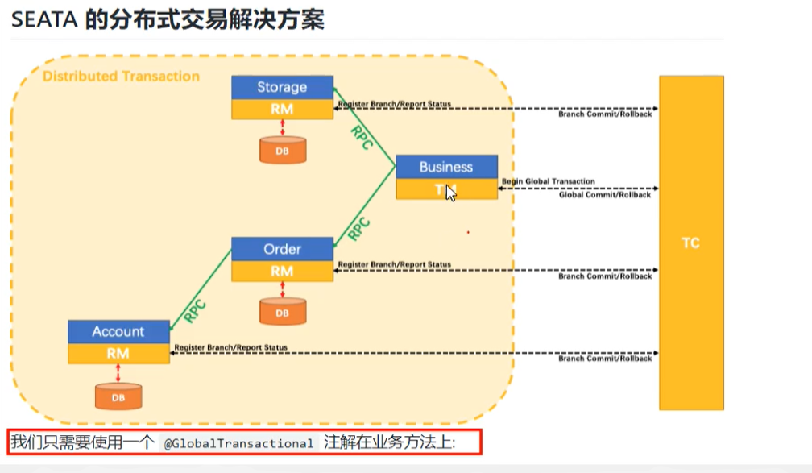

# Seata

## 分布式事务问题


分布式事务问题：一次业务处理需要跨多个服务使用多个数据库存在的全局数据一致性问题

## 什么是Seata

Seata 是一款开源的分布式事务解决方案，致力于提供高性能和简单易用的分布式事务服务。Seata 将为用户提供了 AT、TCC、SAGA 和 XA 事务模式，为用户打造一站式的分布式解决方案。

官方网址： https://seata.io/zh-cn/docs/overview/what-is-seata.html

## 基本术语




## 下载安装配置

### 下载

下载地址：https://seata.io/zh-cn/blog/download.html

下载完成后解压

### 安装配置

1. 配置file.conf

   1. servcie

      ```conf
      service {
        #transaction service group mapping
        vgroupMapping.my_test_tx_group = "fsp_tx_group"
        #only support when registry.type=file, please don't set multiple addresses
        default.grouplist = "127.0.0.1:8091"
        #degrade, current not support
        enableDegrade = false
        #disable seata
        disableGlobalTransaction = false
      }
      ```

   2. store

      ```conf
      store {
        ## store mode: file、db
        mode = "db"
        ## database store property
        db {
          ## the implement of javax.sql.DataSource, such as DruidDataSource(druid)/BasicDataSource(dbcp) etc.
          datasource = "dbcp"
          ## mysql/oracle/h2/oceanbase etc.
          dbType = "mysql"
          driverClassName = "com.mysql.jdbc.Driver"
          url = "jdbc:mysql://127.0.0.1:3306/seata"
          user = "root"
          password = "root"
          minConn = 1
          maxConn = 10
          globalTable = "global_table"
          branchTable = "branch_table"
          lockTable = "lock_table"
          queryLimit = 100
        }
      }
      ```

      主要修改模式-db，db中主要修改mysql的连接信息

2. 配置registry.conf

   ```conf
   registry {
     # file 、nacos 、eureka、redis、zk、consul、etcd3、sofa
     type = "nacos"
     
     nacos {
       serverAddr = "localhost:8848"
       namespace = ""
       cluster = "default"
     }
     # .....
   }
   ```

   修改type为nacos

3. 创建seata数据库并建表

   建表sql位置：https://github.com/seata/seata/blob/develop/script/server/db/mysql.sql

### 启动

1. 先启动nacos

2. 启动seata

   cmd窗口进入seata的bin目录，输入seata-server.bat 回车

## 使用Example

### 创建自己的业务数据库和表

1. order

   ```sql
   DROP TABLE IF EXISTS `t_order`;
   CREATE TABLE `t_order` (
     `id` bigint(11) NOT NULL AUTO_INCREMENT,
     `user_id` bigint(11) DEFAULT NULL COMMENT '用户id',
     `product_id` bigint(11) DEFAULT NULL COMMENT '产品id',
     `count` int(11) DEFAULT NULL COMMENT '数量',
     `money` decimal(11,0) DEFAULT NULL COMMENT '金额',
     `status` int(1) DEFAULT NULL COMMENT '订单状态 0-创建中 1 已完结',
     PRIMARY KEY (`id`)
   ) ENGINE=InnoDB AUTO_INCREMENT=7 DEFAULT CHARSET=utf8;
   ```

2. account

   ```sql
   DROP TABLE IF EXISTS `t_account`;
   CREATE TABLE `t_account` (
     `id` bigint(11) NOT NULL AUTO_INCREMENT COMMENT 'id',
     `user_id` bigint(11) DEFAULT NULL COMMENT '用户id',
     `total` decimal(11,0) DEFAULT NULL COMMENT '总额度',
     `used` decimal(11,0) DEFAULT NULL COMMENT '已用额度',
     `residue` decimal(11,0) DEFAULT NULL COMMENT '剩余可用额度',
     PRIMARY KEY (`id`)
   ) ENGINE=InnoDB AUTO_INCREMENT=2 DEFAULT CHARSET=utf8;
   ```

3. storage

   ```sql
   DROP TABLE IF EXISTS `t_storage`;
   CREATE TABLE `t_storage` (
     `id` bigint(11) NOT NULL AUTO_INCREMENT,
     `product_id` bigint(11) DEFAULT NULL COMMENT '产品id',
     `total` int(11) DEFAULT NULL COMMENT '总库存',
     `used` int(11) DEFAULT NULL COMMENT '已用库存',
     `residue` int(11) DEFAULT NULL COMMENT '剩余库存',
     PRIMARY KEY (`id`)
   ) ENGINE=InnoDB AUTO_INCREMENT=2 DEFAULT CHARSET=utf8;
   ```

### 各个数据创建回滚日志sql

sql语句：

```sql
DROP TABLE IF EXISTS `undo_log`;
CREATE TABLE `undo_log` (
  `id` bigint(20) NOT NULL AUTO_INCREMENT,
  `branch_id` bigint(20) NOT NULL,
  `xid` varchar(100) NOT NULL,
  `context` varchar(128) NOT NULL,
  `rollback_info` longblob NOT NULL,
  `log_status` int(11) NOT NULL,
  `log_created` datetime NOT NULL,
  `log_modified` datetime NOT NULL,
  `ext` varchar(100) DEFAULT NULL,
  PRIMARY KEY (`id`),
  UNIQUE KEY `ux_undo_log` (`xid`,`branch_id`)
) ENGINE=InnoDB DEFAULT CHARSET=utf8;
```

### 业务模块代码编写

1. 创建module
2. pom

```xml
<dependency>
    <groupId>com.alibaba.cloud</groupId>
 <artifactId>spring-cloud-starter-alibaba-seata</artifactId>
    <exclusions>
        <exclusion>
            <groupId>io.seata</groupId>
            <artifactId>seata-all</artifactId>
        </exclusion>
    </exclusions>
</dependency>
<dependency>
    <groupId>io.seata</groupId>
    <artifactId>seata-all</artifactId>
    <version>1.1.0</version>
</dependency>
```

3. yml

```yml
spring:
  cloud:
    alibaba:
      seata:
        tx-service-group: fsp_tx_group # registry.conf中定义的
```

4. registry.conf
5. file.conf