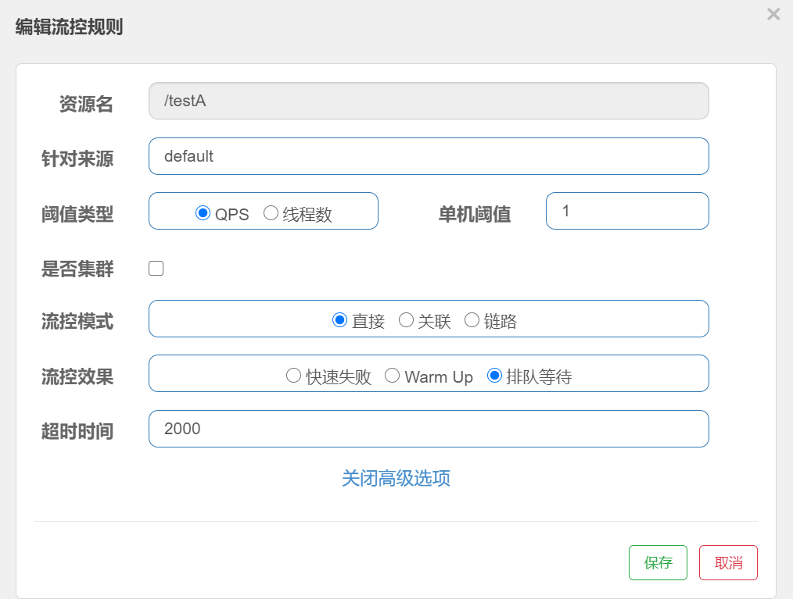

# Sentinel

## 下载安装运行

1. 下载地址：https://github.com/alibaba/Sentinel/releases

2. 下载完成后，输入java -jar sentinelxxx.jar就能运行了

3. 访问：http://localhost:8080

## 初始化监控

1. pom

   ```xml
   <dependencies>
       <!-- nacos client -->
       <dependency>
           <groupId>com.alibaba.cloud</groupId>
           <artifactId>spring-cloud-starter-alibaba-nacos-discovery</artifactId>
       </dependency>
   	<!-- sentinel rule persistence into nacos-->
       <dependency>
           <groupId>com.alibaba.csp</groupId>
           <artifactId>sentinel-datasource-nacos</artifactId>
       </dependency>
   
       <!-- springcloud alibaba sentinel-->
       <dependency>
           <groupId>com.alibaba.cloud</groupId>
           <artifactId>spring-cloud-starter-alibaba-sentinel</artifactId>
       </dependency>
       <!-- web actuator -->
       <dependency>
           <groupId>org.springframework.boot</groupId>
           <artifactId>spring-boot-starter-web</artifactId>
       </dependency>
       <dependency>
           <groupId>org.springframework.boot</groupId>
           <artifactId>spring-boot-starter-actuator</artifactId>
       </dependency>
       <!-- 通用配置 -->
       <!-- 热部署 -->
       <dependency>
           <groupId>org.springframework.boot</groupId>
           <artifactId>spring-boot-devtools</artifactId>
           <scope>runtime</scope>
           <optional>true</optional>
       </dependency>
       <dependency>
           <groupId>org.projectlombok</groupId>
           <artifactId>lombok</artifactId>
           <optional>true</optional>
       </dependency>
       <dependency>
           <groupId>org.springframework.boot</groupId>
           <artifactId>spring-boot-starter-test</artifactId>
           <scope>test</scope>
       </dependency>
   </dependencies>
   ```

2. yml

   ```yml
   server:
     port: 8041
   
   spring:
     application:
       name: cloud-sentinel-payment
   
     cloud:
       nacos:
         discovery:
           server-addr: localhost:8848
       sentinel:
         transport:
           dashboard: localhost:8080
           # 默认8719端口，如果被占用会自动+1
           port: 8719
   
   management:
     endpoints:
       web:
         exposure:
           include: '*'
   ```

3. 启动类

   ```java
   @SpringBootApplication
   @EnableDiscoveryClient
   public class Payment8041 {
       public static void main(String[] args) {
           SpringApplication.run(Payment8041.class, args);
       }
   }
   ```

4. 业务类

   略

5. 启动服务后，访问sentinel仪表盘

   因为sentinel是懒加载，没有访问过接口sentinel上什么都没有，访问过一次接口后就有数据

   

## 流控

### 流控规则

1. 单资源Qps流控

   

   效果：1秒内超过一次query，会被拒绝

   

2. 单资源线程数流控

   

   线程数和QPS的区别：

   ​	线程数模式：请求进入服务，创建线程，线程如果超过阈值，通过异常的形式导致请求被拒绝

   ​	QPS：请求未进入服务，当qps超过阈值时，直接拒绝

3. 关联资源Qps流控

   

   当被关联的资源超过阈值时，资源会执行流量控制

4. 链路模式流控

5. 预热效果流控（QPS)：

   

   1. 冷加载因子：默认为3
   2. 流控会分为两个阶段：
      1. 预热阶段：此时服务阈值是设置阈值/冷加载因子
      2. 正常阶段：预热时长一过，服务阈值为设置的阈值
   3. **<u>令牌桶算法</u>**

6. 排队等待流控(QPS)：

   

   使用的是匀速器模式：
   
   底层是漏桶算法

## 降级

在调用访问一些不稳定状态的资源时，sentinel为了防止级联错误，将服务降级，直接失败，在降级的一定时间窗口期内，整个资源熔断

### RT

平均时间： 

​	1s内持续进入5个请求，并且请求的平均响应时间大于阈值，那么出发服务降级（打开断路器）资源熔断，在窗口期内资源无法使用，窗口期过了，关闭降级


使用：


这条规则的含义是：当1秒内连续通过5个请求，平均响应的时间大于200ms时，打开断路器，开启降级，服务资源将不可用

### 异常比列


### 异常数

当1分钟内异常数超过阈值后，服务降级，资源在时间窗口内不可用

时间窗口一定要大于等于60s（因为小于60s没有意义，小于60s可能窗口过了服务仍然熔断）


## 热点key

1. 配置规则


2. 代码修改

   ```java
   @GetMapping("/testHotKey")
   @SentinelResource(value = "testHotKey", blockHandler = "dealTestHotKey")
   // 如果是热点key规则一定要写blockHandler不加的话返回就是错误页，很不友好
   public String testHotKey(@RequestParam(value = "p1", required = false) String p1,
                            @RequestParam(value = "p2", required = false) String p2) {
       log.info("Request come in. p1: {}, p2: {}", p1, p2);
       return "two param comes in:" + p1 + "->" + p2;
   }
   
   public String dealTestHotKey(String p1, String p2, BlockException e) {
       return "some thing is wrong!";
   }
   ```

当我们访问资源传入指定位置的参数，这样的qps超过阈值，此时服务就会降级，直接调用我们写好的blockHandler

注意：

1. 如果指定位置的参数没有传入，传入其他位置的参数，这样的qps不会引起服务降级

2. 如果资源中发生了异常，前台还是会受到异常页面的相应，这是因为我们配置的sentinelResource是用来处理我们再sentinel控制台配置的降级规则，而不是处理程序内部错误的

## 系统规则

使用于分布式系统整体的规则，比较“**危险**”，不建议使用

## @SentinelResource配置

1. **关闭微服务，配置过的规则会被删除，这些都是临时性的**

2. 我们的规则可以给请求的接口（rest资源）来配置，也可以给@SentinelResource修饰的资源来配置（热点必须用这个）
3. @SentinelResource重设置的blockHandler只会用于哪些针对@SentinelResource的规则
4. 不支持private方法

#### 客户自定义限流处理逻辑

1. 编写自己的处理类

   **要注意返回类型和限流资源的返回类型相同**

   ```java
   public class MyHandler {
       public static CommonResultDto handleException(BlockException e) {
           return new CommonResultDto(444, "some exception: " + e);
       }
   }
   ```

2. 编写@SentinelResource注解

   ```java
   @GetMapping("/testResource")
   @SentinelResource(value = "testResource",
                     blockHandlerClass = MyHandler.class,
                     blockHandler = "handleException")
   public CommonResultDto testSentinelResource() {
       return new CommonResultDto(200, "success");
   }
   ```

   blockHandlerClass 指定处理类

   blockHandler 指定方法


#### 比较blockHandler和fallback

```java
@GetMapping("/order/get/{id}")
//    @SentinelResource(value = "payment", fallback = "queryPaymentFallBack")
@SentinelResource(value = "payment", blockHandler = "blockPayment", fallback = "queryPaymentFallBack")
public CommonResultDto queryPayment(@PathVariable("id") Integer id) throws Exception {
    if (id == 4) {
        throw new Exception("something wrong");
    }
    return restTemplate.getForObject(PAYMENT_URL + "/payment/{id}", CommonResultDto.class, id);
}

public CommonResultDto blockPayment( Integer id, BlockException blockException) {
    return new CommonResultDto(555, "block exception");
}

public CommonResultDto queryPaymentFallBack( Integer id, Throwable throwable) {
    return new CommonResultDto(444, "exception occurs");
}
```

blockHandler用来处理在sentinel仪表盘配置的规则，fallback用来处理异常场景，handler一定要有BlockException， fallback也要讲异常作为参数放入

#### exceptionsToIgnore = {xxx.class}

fallback忽略响应异常的处理


## 熔断

## 持久化配置

