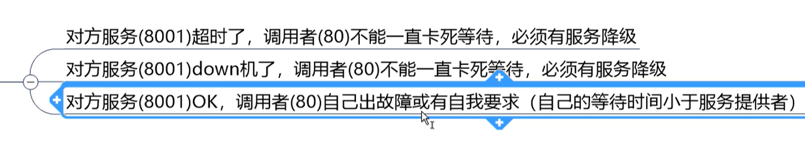

## Hystrix

### 1.概述

1. 是什么

   是处理分布式系统延迟和容错的开源库

   

2. 干啥用的

   微服务架构中，存在一个服务调用链，其中一个服务挂了或者短时间内有问题，会导致整条微服务调用链直接无法使用，此时请求进来会排队，大量请求堆积会导致服务器宕机

3. 资料

   Hystrix 介绍： https://www.cnblogs.com/cjsblog/p/9391819.html 

   Hystrix 介绍2： https://blog.csdn.net/hjq_ku/article/details/89520168

### 2. 概念

1. 服务降级

   当我们某个服务不可用了，给调用方返回一个符合预期的可处理的备选响应

2. 服务熔断

   就是系统要炸的时候，自动降级所有服务，返回备选响应

3. 服务限流

   高并发的应用，限制同时处理的请求数量，从而达到限流的目的

### 3. 降级容错解决的维度要求



### 4. 使用方式

1. 依赖

```xml
<!-- cloud hystrix -->
<dependency>
    <groupId>org.springframework.cloud</groupId>
    <artifactId>spring-cloud-starter-netflix-hystrix</artifactId>
</dependency>
```

2. feign配置

```yml
feign:
  hystrix:
    enabled: true
```

3. 创建fallback类（继承feign客户端）

```java
@Component
public class PaymentCallBack implements PaymentFeignService {
    @Override
    public String methodOk(String id) {
        return "Oh!Error";
    }

    @Override
    public String methodTimeout() {
        return "Eh.....Error";
    }
}
```

4. **@FeignClient**注解中添加**fallback class**

```java
@Component
@FeignClient(value = "cloud-provider-hystrix-payment", fallback = PaymentCallBack.class)
public interface PaymentFeignService {

    @GetMapping("/paymentOK/get/{id}")
    public String methodOk(@PathVariable("id") String id);

    @GetMapping("/paymentFailed/get")
    public String methodTimeout();
}
```


### 4. 按服务角色使用Hystrix

1. 服务提供者

   1. 在方法上添加注解

      ```java
      // 在需要监控的方法上添加HystrixCommand注解，fallbackMethod是兜底的返回方法这个注解能够应对超时以及运行时异常，一旦发生服务不可用，那么会调用fallback方法进行服务降级
      @HystrixCommand(fallbackMethod = "paymentFailedFallBack", commandProperties = {
                  @HystrixProperty(name = "execution.isolation.thread.timeoutInMilliseconds", value = "3000")
          })
      public String methodTimeout() {
          int part = 10/0;
          int sleepTime = 2;
          try {
              TimeUnit.SECONDS.sleep(sleepTime);
          } catch (InterruptedException e) {
              e.printStackTrace();
          }
          return "something wrong it cost 5 s " + Thread.currentThread().getName();
      }
      
      
      public String paymentFailedFallBack() {
          return "Oops! something wrong! Please try later" + Thread.currentThread().getName();
      }
      ```

   2. 在启动类上添加**@EnableCircuitBreaker**注解

      ```java
      @SpringBootApplication
      @EnableDiscoveryClient
      @EnableCircuitBreaker
      public class PaymentMain8001 {
          public static void main(String[] args) {
              SpringApplication.run(PaymentMain8001.class);
          }
      }
      ```

   这样的机制能够应对运行时异常和超时的状况

   只能应对方法中的异常，上层方法的异常管不了

2. 服务消费者


### 5. 全局配置DefultCallback


# 注意事项

1. 如果修改了**@HystrixPorperty中的内容**，需要重启微服务
2. 


