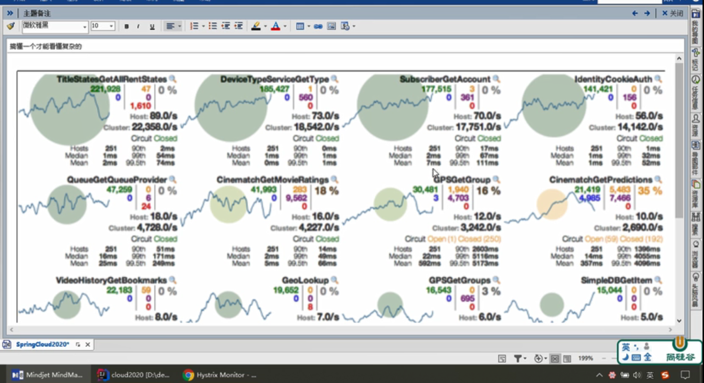

# Hystrix- 服务熔断

## 熔断

类比断路器，当电流过大的时候，断路器会跳闸，电路不可用，然后人为的降低电流，断路器开关打开，电路恢复，电器正常使用

当我们的应用突然有部分无法正常使用了，此时有大量的请求进来，会占用大量的系统资源，严重的可能会导致系统崩溃宕机，这个时候我们就引入熔断器，如果在一个时间范围内应用的返回一定比率上都是错误的，或者超时，那么我们就认为这个应用短期内不可用，熔断器就熔断了。此时不管你是何种请求都会降级服务（调用fallback方法）

## 服务熔断和服务降级的区别

服务降级是指，当一个依赖出现问题导致调用出错或者超时的时候，调用fallback方法，服务降级是尝试去调用依赖的。

服务熔断是指，当一个时间范围内错误调用或者超时调用达到一定比例的时候，不管你什么请求过来都调用fallback方法，断路器一旦打开，就不会去调用哪个有问题的依赖了。

服务降级是没有办法解决“雪崩效应”的，熔断可以。

## Hystrix工作流程


1. 初始化：构造HystrixCommand或者HystrixObservableCommand

2. 检查时候有缓存，如果有就返回缓存，没有的话进行下一步

3. 检查断路器是否已经打开，如果打开断路器了就直接fallback，没打开就下一步

4. 检查信号量和线程资源，如果资源充足下一步，没资源就fallback

   ...

## 使用方法

在需要使用断路器的方法上添加注解

```java
@Override
@HystrixCommand(defaultFallback = "circuitBreakerFallBack", commandProperties = {
    @HystrixProperty(name = "circuitBreaker.enabled", value = "true"), // 是否开启断路器
    @HystrixProperty(name = "circuitBreaker.requestVolumeThreshold", value = "10"), // 请求次数
    @HystrixProperty(name = "circuitBreaker.sleepWindowInMilliseconds", value = "10000"), // 时间窗口期
    @HystrixProperty(name = "circuitBreaker.errorThresholdPercentage", value = "60") // 失败率达到多少后跳闸
})
public String paymentCircuitBreaker(Integer id) {
    if (id < 0) {
        throw new RuntimeException("*******不能为负数");
    }
    String uuid = IdUtil.simpleUUID();
    return "success! The local Thread is: " +
        Thread.currentThread().getName() + "id: " + uuid;
}

public String circuitBreakerFallBack(Integer id) {
    return "id: " + id + " 不能为负或者不存在，请重试!";
}
```

**属性具体查看可以看HystrixCommandProperties**

## 图形监控dashboard

1. 搭建dashboard工程

   1. pom中添加dashboard的依赖

      ```xml
      <!-- hystrix -->
      <dependency>
          <groupId>org.springframework.cloud</groupId>
          <artifactId>spring-cloud-starter-netflix-hystrix</artifactId>
      </dependency>
      ```

   2. 启动类增加**@EnableHystrixDashboard**注解

      ```java
      @SpringBootApplication
      @EnableHystrixDashboard
      public class DashBoardApp {
          public static void main(String[] args) {
              SpringApplication.run(DashBoardApp.class, args);
          }
      }
      ```

2. 被监控的app设置

   1. 确保pom中有一下依赖

      ```xml
      <dependency>
          <groupId>org.springframework.boot</groupId>
          <artifactId>spring-boot-starter-actuator</artifactId>
      </dependency>
      ```

   2. 在启动类中添加下面的内容

      ```java
      /**
           * 此配置是为了服务监控而配置，与服务容错本身无关，springcloud升级后的坑
           * ServletRegistrationBean因为SpringBoot的默认路径不是 “/hystrix.stream"
           * 只要在自己的项目里配置上下的servlet就可以了
           */
      @Bean
      public ServletRegistrationBean getServlet() {
          HystrixMetricsStreamServlet streamServlet = new HystrixMetricsStreamServlet() ;
          ServletRegistrationBean registrationBean = new ServletRegistrationBean(streamServlet);
          registrationBean.setLoadOnStartup(1);
          registrationBean.addUrlMappings("/hystrix.stream");
          registrationBean.setName("HystrixMetricsStreamServlet");
          return  registrationBean;
      }
      ```

   3. 打开Hsytrix监控页面

      地址：http://localhost:9010/hystrix

   4. 在监控接口输入监控服务接口

      localhost:8001/hystrix.stream


