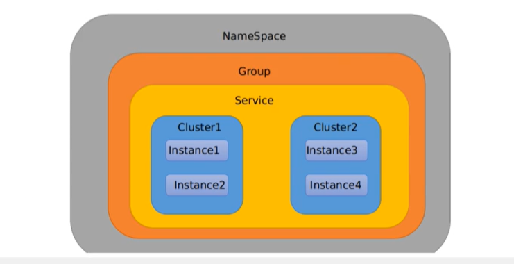
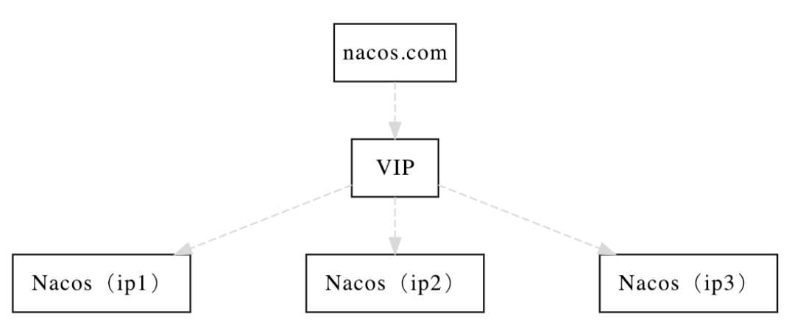
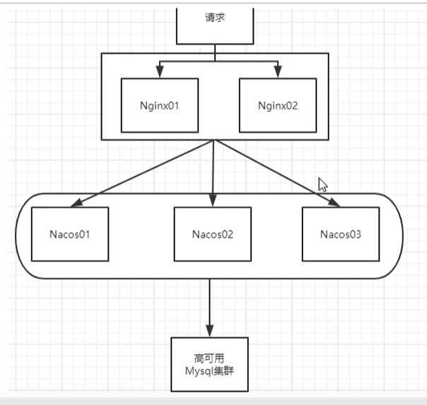
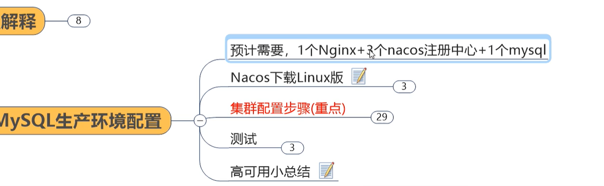

# NacosConfig


## 使用

1. pom

   ```xml
   <dependency>
       <groupId>com.alibaba.cloud</groupId>
       <artifactId>spring-cloud-starter-alibaba-nacos-config</artifactId>
   </dependency>
   ```

2. 


## 分组管理

三个坐标： namespace、group、dataId唯一确定一个配置文件	




# 集群配置和持久化配置

1. 概念：

   1. VIP：虚拟ip（nginx）

2. 架构图

   

   细化版：

   




附录：

1. nacos-config共享配置的设计：https://github.com/alibaba/spring-cloud-alibaba/issues/141
2. 